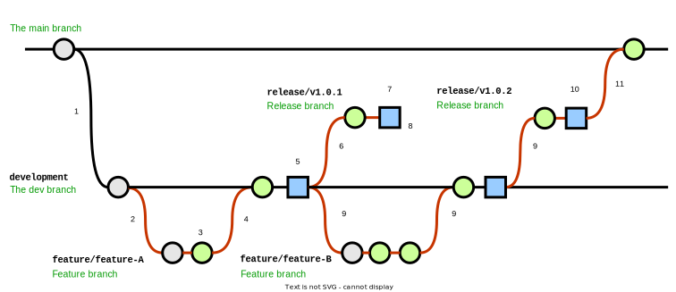
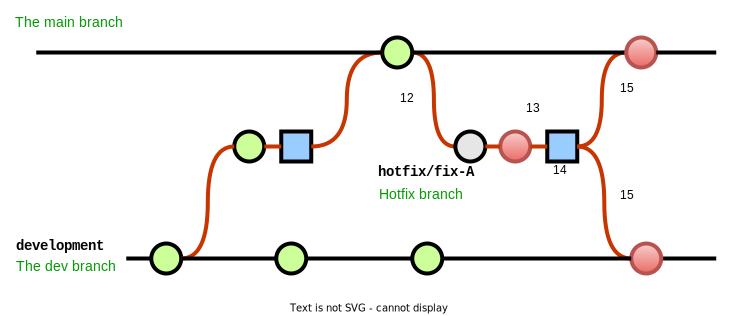

# Introduction

This post will give a brief introduction and explanation to `Git` and `Git workflows`, and then go into detail for the most prominent workflows (in my experience), when to use them, as well as the main pros and cons of each approach.

---

## Background
### Git introduction

For those unfamiliar, Git (as defined on [git-scm.com](https://git-scm.com/)) is a `free and open source distributed version control system, designed to handle everything from small to very large projects with speed and efficiency.`  

This post will **not** go into the details of Git, but some characteristics:
1. Distributed
1. Fast
1. Efficient
1. Cheap and simple branching
1. Has a learning curve - but very easy to use once understood

Some notes:
- **Point 4:** This is the key to Git. Creating and working with branches is simple and quick. `This is key to most well working workflow`.
- **Point 5:** This is the opposite of what is described on [git-scm.com](https://git-scm.com/), which states that Git is _`easy to learn`_. I have found that this is not the case, especially when coming from a background of a source control system such as SVN or Azure Devops TFVC. However once the basics are understood, then it is _easy to use_.

---

### Git branches

When using Git, there are usually two types of branches used:
- `Long-lived branches`: These are _permanent_ branches in the repository. A repository will often have two long-lived branched called `development` and `main (or master)`
- `Short-lived branches`: These are temporary branches created for a specific purpose (such as adding a new feature), and are deleted once they have served their purpose. Generally these branches follow a naming standard, often `feature/issue-number`, `feature/description` - but this is flexible and up to do team to decide. However, whichever standard is chosen, it should be consistently used when naming branches.

Working through the various workflows below will add to and expand on the above definitions.

---

### Workflow introduction

In this context, a workflow is simply `a recipe or recommendation for how to use Git to accomplish work in a consistent and productive manner`. Typically for software development, this _work_ involves code being released into production, and is usually facilitated by a build server and CI/CD pipelines (using GitHub Actions, Azure Devops Pipelines, Jenkins, for example)

Below a number of popular widely accepted _best practice_ workflows will be described (Git Flow and GitHub Flow), as well as two workflows I've personally experienced being used extensively in certain use cases. 

---

## Workflows

The diagram `legend`:

  

A note on `builds` - In the below workflow explanations, when a `build` is mentioned, it can be done in one of two ways:
- `Build configuration method`: multiple artifacts are produced, each one with a different build configuration (dev, test, production). As multiple artifacts are being produced, this usually is a longer process, and a more legacy approach (but still valid).
- `Environment variable method`: one artifacts is produced, and the configuration (dev, test, production) is determined by an environment variable injected into the application on startup. The benefit of this approach is one can ensure that the _exact same code_ is deployed to all environments, and as only one artifact is produced, the process is quicker. This is a newer approach.

---

### Solo Flow

**`Solo Flow explained:`**

This is the simplest of flows, and doesn't involve any additional branches. **Solo Flow** is named as such as only one branch is involved (usually _main_) and typically this flow would be used by a solo developer. The single branch is long-lived and exists for the entirety of the repository.

Pros:
- Very simple to implement

Cons:
- Branch is not consistently stable *
- A hotfix could cause complications **
- Doesn't scale to multiple developers easily

When best to use:
- When only an individual developer is working in the repository
- When the code is not going to have "releases" - such as scratchpad, playpen or proof of concept/technology repositories

---

**`Solo Flow process:`**

  

1. Code is committed directly into the _main_ branch
2. A build is done, and released to the relevant environment. Usually this is `dev -> test -> production` proceeding through each environment as the release is tested and signed off
3. If a hotfix is required, the fix is committed to the _main_ branch, tested and then released

**Additional notes**:  
- \* **Stability**: `At any given time, it is not known if the branch is stable or not` as the code in the main branch would not necessarily have been tested. For example, in the diagram at point *, if a hotfix would be required, there is no guarantee that the current state of the branch is stable, as the previous build or commit may not have been tested.  

- \*\* **Complications**: Related to the previous point, if an urgent hot fix is required, it may cause complications as there could be `untested commits which would "interfere" with the hot fix release`. In the example, the previous commit, which is unrelated to the hotfix, would now need to be included in the hotfix release (tested or not), or a number of Git operations would need to be performed to try undo the untested code.

---

### First Flow
**`First Flow explained`**:

This is the simplest of flows which makes use of multiple branches. Named **First Flow** as it is most likely the first flow one might use involving multiple branches. Two long-lived branches exists with this flow, usually _development_ and _main_, and exist for the entirety of the repository

Pros:
- Very simple to implement
- Main branch is fairly stable *

Cons:
- A hotfix may cause complications **
- Doesn't scale to multiple developers easily 

When best to use:
- When only an individual or very small (1-3) number of contributors are working in the repository
---

**`First Flow process`**:

1. The _development_ branch is initially, once off, branched from the _main_ branch
2. Code is committed directly into the _development_ branch
3. A build is done, and released to the development environment
4. Once dev-tested in the development environment, the code is merged (via a pull request) into the _main_ branch
5. Another build is then done and released to the relevant environment. Usually this is `test/uat -> production` proceeding through each environment as the release is tested and signed off
6. If a hotfix is required, the fix is committed to the _main_ branch, a build created, tested and then released. The hotfix code is also merged back into the _development_ branch

**Additional notes**:  
- \* Stability: As with the `Solo Flow`, the situation regarding stability is the same, `at any given time, it is not known if the branch is stable or not`. However, with the `First Flow` the code has been deployed to and tested in a _development_ environment before being merged into _main_. This does obviously not mean its stable once merged into _main_, however it is **more stable** when compared with the `Solo Flow`.  
For example, in the diagram at point *, when the hotfix is required, there is no guarantee that the current state of the branch is stable, as the previous build or commit may not have been tested.  

- \*\* Complications: As with the `Solo Flow`, if an urgent hot fix is required, it may cause complications as there could be `untested commits which would "interfere" with the hot fix release`. In the example, the previous commit, which is unrelated to the hotfix, would now need to be tested and included in the hotfix build., or the _main_ branch would need to somehow be reverted back to before the commit

---

### Gitflow
**`Gitflow explained:`**

The `Gitflow` workflow is an industry standard workflow, and has gained in popularity in the past few years. It has fallen slightly out of popularity in favour of _trunk based workflows_ (such as **GitHub Flow** described below), however it still has its place.  
It especially `works well when facilitating a more traditional release model, releasing to production on a known schedule (e.g. every two weeks)`. It is not suited to the model of releasing multiple times per day, as the flow of code through the workflow can take time.

Pros:
- Main branch is always stable *
- Scales well with large number of developers
- Handles hotfixes well **
- Code reviews can be built into the workflow process ***

Cons:
- Complicated workflow
- Takes time to push code through the workflow

When best to use:
- When there are a number of contributors to the repository (although the workflow does also work with smaller teams as well)
- When the product is to be released on a known scheduled (e.g. every two weeks)

---

**`Gitflow process`**:

1. The _development_ branch is initially, once off, branched from the _main_ branch
2. For any changes (apart from production hotfixes), a new short-live _feature_ branch is created from the _development_ branch
3. Code is committed into the _feature_ branch
4. Once the coding is completed, the _feature_ branch is merged into the _development_ branch (via a pull request). Commits are **not** permitted directly into _development_ branch, all code commits are done via pull requests
5. A build is  done and released to the development environment
6. Once dev-tested in the development environment, a new short-lives _release_ branch is created from the _development_ branch
7. A build is done from this _release_ branch and released initially into the tst environment
8. If testing is not successful, the _release_ branch is abandoned and deleted
9. A new _feature_ branch will be created to address the cause of the release failing testing in step 8, and steps 2-8 are repeated
10. Once testing has been completed successfully it is released into the production environment
11. The _release_ branch is then merged into the _main_ branch (via a pull request) and deleted

12. If a hotfix is required, a short-lived _hotfix_ branch is created from the _main_ branch
13. The code fix is committed into the _hotfix_ branch, a build is done and released into the tst environment
14. Once the build has been successfully tested, it is then released into the production environment
15. The _hotfix_ branch is then merged into the _main_ as well as the _development_ branch, and then deleted

**Additional notes**:  
- \* Stability: With the `Git Flow` workflow, code is only merged into the _main_ branch once is has been tested and released into production. Therefore at any given time, the code in the _main_ branch should be stable and tested, and is a snapshot of the current state of the production environment.

- \*\* Complications: With `Git Flow`, as the code in the _main_ branch is always a snapshot of the current production environment, if an urgent hot fix is required, the _main_ branch will not have any untested committed code which can cause complications with the hotfix release.

- \*\*\* Code reviews: In step 4 above, the merging of the code is done via a _pull request_. The _pull request_ mechanism easily facilities code reviews as it allows for review of all the code being merged before approval. As the _pull request_ process is built into the `Git Flow` workflow, a code review process is also (optionally, but recommended) built into the process.

---

### GitHub Flow
**`Gitflow explained:`**:

The `GitHub Flow` workflow is also an industry standard workflow - which came about and has gained in popularity due to its simplicity.
Even though, as the name described, the `GitHub Flow` is primarily used when working with [GitHub](http://www.github.com), it is not limited to only being used on GitHub and can be used on any platform with a Git repository.  
This workflow `works especially well when doing production deployments often, not largely based around a scheduled release`. It is well suited to the model of releasing multiple times per day, as it is simple and fast to get code through the workflow.

Pros:
- Very simple process
- Main branch is always stable *
- Scales well with large number of developers
- Handles hotfixes well **
- Code reviews can be built into the workflow process ***

Cons:
- Stricter controls and discipline required to make it work successfully ****

When best to use:
- When there are a number of contributors to the repository (although the workflow does also work with smaller teams as well)
- When the product is to be released often, not necessarily on a set schedule (daily or multiple times per day)
- When the team has mature processes, checks and balances in place (unit tests, code reviews, dev standards)

---
**`Gitflow process:`**:

1. Only one long-lived _main_ branch exists
2. For any changes, a new short-live _feature_ branch is created from the _main_ branch
3. Code is committed into the _feature_ branch
4. Either during or after the coding process a pull request is created to merge into _main_ - but not approved (yet)
5. Once the code has been reviewed and discussed, a build and release is performed, proceeding, usually, through the `dev -> test -> production` environments
6. The pull request is approved and the code merged into _main_, and the _feature_ branch deleted
7. _Hotfixes_ follow the same process as _features_, following steps 2-6

**Additional notes**:  
- \* Stability: With the `GitHub Flow` workflow, one of the _hard_ rules is that anything is main is deployable. Therefor at any given time, the code in the _main_ branch _has_ to be stable, and should be code is only merged into _main_ once tested.

- \*\* Complications: As the code is being released into production as it is being "completed" (and reviewed and tested), there is almost always not complications with hotfix releases, as the code in the _main_ branch is a snapshot of the latest code. Hotfixes and features are treated and released the same way.

- \*\*\* Code reviews: In step 4 above, the merging of the code is done via a _pull request_. The _pull request_ mechanism easily facilities code reviews as it allows for review of all the code being merged before it is approved. As the _pull request_ process is built into the `GitHub Flow` workflow, a code review process is also (optionally) built into the process. However, as this flow is a lot "faster" than the `GitFlow`, the code review process is highly recommended and should always be part of the release pipeline.

- \*\*\*\* Controls: Even though the workflow is very simply, it requires strict controls and discipline from the team to make it work, even under tight deadlines (which is often when steps and reviews are skipped). Due to the workflow's rapid release nature, the pull request discussions and code reviews are essential in making sure that the code released and merged into _main_ is quality code. Relevant unit tests should also be a high priority (they should always be a high priority, but especially with this workflow) to facilitate quick, but thorough testing and turn around time to release into the production environment.

---

## Conclusion

You should now have an understanding of a number of different workflows, their pros and codes and when to best use them. The workflows described in this post are by no means the only ones available, but are the most common and practical in a real world environment.

A workflow shouldn't be a hindrance or a bottleneck, but should facilitate and improve the process of getting code released. As a developer or a team of developers, you will need try a number of workflows, and adopt one which makes sense and works for you or the team.

---
## References
[Git](https://git-scm.com/)  
[GitFlow](https://www.atlassian.com/git/tutorials/comparing-workflows/gitflow-workflow)  
[GitHub Flow](https://githubflow.github.io/)