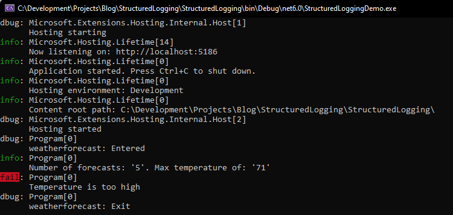
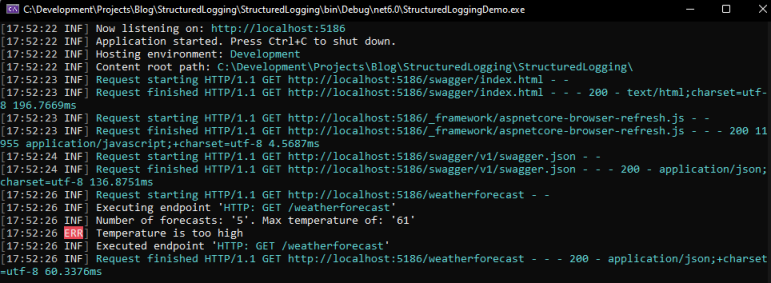
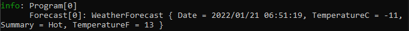
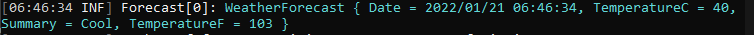
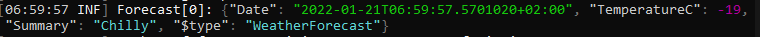
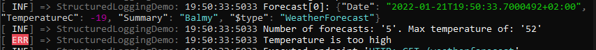
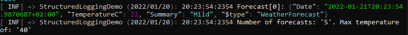
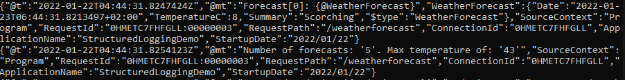

## Introduction

This post will give an introduction to `structured logging`, why its needed and should be used. It will also go into detail how to implement and customize the output using Serilog.

---

## Default .NET Logging
Before looking at structured logging, we'll take a look at the default .NET logging implementation.  

The default logger can be utilized by injecting `ILogger<CategoryName>` into the relevant constructor. The _ILogger<>_ interface and its implementation are registered automatically with the .NET dependency injection container on startup.

Let's look at an example using the default minimal API project template (using .NET6). This is not representative of a real production scenario, and is used only for demo purposes (e.g. an exception generally should not be caught, logged and ignored)  

Below is a **modified** version of the default _GET_ endpoint which is included as part of the template. 

```csharp
// ILogger<> is injected. The same can be done 
// using the constructor of any class.
app.MapGet("/weatherforecast", (ILogger<Program> logger) =>
{
    // A debug message is logged when the method is entered and exited.
    logger.LogDebug("weatherforecast: Entered");

    var forecast = Enumerable.Range(1, 5).Select(index =>
        new WeatherForecast
          (
              DateTime.Now.AddDays(index),
              Random.Shared.Next(-20, 55),
              summaries[Random.Shared.Next(summaries.Length)]
          )).ToArray();
    
    // An informational message is logged to give some
    // context as to what the method output.
    logger.LogInformation($"Number of forecasts: '{forecast.Count()}'." +
        $" Max temperature of: '{forecast.Max(x => x.TemperatureC)}'");

    try
    {
        // If any of the temperature values about to be returned 
        // are greater than 50C, throw a exception.
        if(forecast.Any(x => x.TemperatureC > 50))
        {
            throw new Exception("Temperature is too high");
        }
    }
    catch (Exception ex)
    {
        // Catch any exceptions, and log the error message.
        logger.LogError(ex.Message);
    }
    finally
    {
        logger.LogDebug("weatherforecast: Exit");
    }

    return forecast;
})
.WithName("GetWeatherForecast");
```

The output when the application is run, and the above method is invoked, is as follows:

  

- The **log level** (e.g. debug, information, error) is reflected on the left hand side, in the various colours.
- The **Program [0]** shown refers to the _CategoryName_ of the ILogger instance. This is determine by the full name (namespace + class name) of the generic parameter used when injecting _ILogger<>_.  
    - In the above example, `ILogger<Program>` is injected, so the category is the full name of `Program`, which in this example is just _Program_.  
    - The **[0]** refers to an **EventId** (in this case, this has not been set)

The **Logging** section in the appsettings.json file can be used to determine the minimum log level for a specific category name, or for all categories.
Below is a sample the appsettings.json **Logging** section:

```json
"Logging": {
    "LogLevel": {
        "Default": "Information",
        "Microsoft.AspNetCore": "Error"
    }
}
```

In the above example, as the default log level is **"Information"**, invoking _logger.LogDebug_ would not output any data as _debug has a lower log level than information_.  
In additional, any log calls which have a category name of **"Microsoft.AspNetCore"** will not be logged unless _error or above_ is being logged.

This mechanism can be used to log different types of data, based on the category of the data.

There is more to the default .NET logging infrastructure, not covered in this post - see the references below which contain a link to the official .NET logging documentation.

---
## The issue with default logging

The default logging described above works well, and there is `nothing inherently "wrong" with it`.  

However, the big problem is that there is `no consistency with the structure of the information being output`.
- **What time was the message output?**
- **What application logged the message?** Especially important if multiple application are logging to a central location
- **How to identity if multiple message are related or linked to each other?** How can we tell which messages are all related to a single http request, especially if multiple requests are being served at the same time?

There is also the question of how a collection of messages in various different formats can easily be indexed and searched.

These could all be addressed by manually making sure that each and every time any message is logged that it:
- Contains the date and time
- Contains the application name
- Contains a context/request id  

However, there is still no guaranteed message structure and format - this is where structured logging steps in.  
`Structured logging ensures that any information which is output, is always done so in a consistent, structured, well-defined format`.

---

## Structured logging 

.NET doesn't perform structured logging out the box, so a 3rd party library will be used - [`Serilog`](https://serilog.net/). Serilog has become the defacto standard for doing structured logging due to its ease of use, and configurability.  

Serilog works by replacing the default _ILogger<>_ implementation with its own implementation - so no changes are required to any part of the code which use any  _ILogger_ methods. The application only needs to be configured on startup to use the Serilog implementation instead of the default one.

<?# InfoBlock ?>
**Serilog** can be configured to send the log messages to one or multiple _sink(s)_, which are data destinations. In the samples below only the console sink will be configured
<?#/ InfoBlock ?>

In the below example. the `Serilog`, `Serilog.AspNetCore` and `Serilog.Sinks.Console` NuGet packages have been added to the project.


```csharp
using Serilog;

var builder = WebApplication.CreateBuilder(args);

builder.Services.AddEndpointsApiExplorer();
builder.Services.AddSwaggerGen();

// Only change made to the application
builder.Host.UseSerilog((context, loggerConfig) =>
{
    loggerConfig.WriteTo.Console();
});

var app = builder.Build();

// Configure the HTTP request pipeline.
if (app.Environment.IsDevelopment())
{
    app.UseSwagger();
    app.UseSwaggerUI();
}
```

The code is configuring the builder host (an IHostBuilder implementation) to _Use Serilog_, and then configures which sinks to _Write To_.  
As `Serilog.Sinks.Console` is the only Serilog sink package added to the project, only "WriteTo._Console_" is available.

By adding just these few lines, Serilog now takes over the implementation of _ILogger<>_, and the output now looks as follows:

 

The format of the output is `now always in a standard format`, the Serilog _default output template_ which is `{Timestamp:HH:mm:ss} [{EventType:x8} {Level:u3}] {Message:lj}{NewLine}{Exception}`

However, the _output template_ can be updated and customized, which will be explored in the next section.

---

## Refine and customize

### Object parameters

One important aspect of Serilog, is that it will `automatically serialize object parameters to JSON and reflect that in the output`, while the default .NET ILogger implementation will `call the ToString() method on the object`.

In our sample, this actually results in the same output, as `WeatherForecast is a record` and it's _ToString()_ implementation will return a JSON representation of the record.  

If the ILogger is used to log a _record of type WeatherForecast_:

```csharp
    logger.LogInformation("Forecast[0]: {@WeatherForecast}", forecasts[0]);
```

The output message is the same, just in different output formats:

Default .NET ILogger:
 

Serilog:  
 

However, `if WeatherForecast was a class, instead of a record, the output would be vastly different`.  

Assume that WeatherForecast is now a class with the same fields as the record, and that forecasts[0] is an instance of `class WeatherForecast`:

Default .NET ILogger:
 

Serilog:  
 

The default `.NET ILogger outputs the ToString() result`, while Serilog `outputs a the result of serializing the object` (as well as including the object type).

---

### Output customization

There are a couple of ways to change the output format:

#### Output Format

When specifying which sinks to write to, it is possible to _overwrite the default output template for that sink_.  In the below example, 
1. The log level has been moved to the start of the template
1. A constant application name ("StructuredLoggingDemo") has been included
1. Milliseconds now included in the time stamp

```csharp
builder.Host.UseSerilog((context, loggerConfig) =>
{
     loggerConfig.WriteTo.Console(outputTemplate: "[{EventType:x8} {Level:u3}] => " +
        "StructuredLoggingDemo: {Timestamp:HH:mm:ss:ms} {Message:lj}{NewLine}{Exception}");
});
```

This results in the output looking as follows, with the updates mentioned above included:

 

Serilog, and by extension the template, can also be enriched with additional properties at runtime.  

Below Serilog is enriched with:
- The application name, using reflection
- The application start up date (admittedly, not the most useful thing to include on _every_ log message, but acceptable for a demo application)

These additional properties are then being utilized in the output template with the format `{Enrich_Property_Name}` ({ApplicationName} and {StartupDate} in the below example)

```csharp
builder.Host.UseSerilog((context, loggerConfig) =>
{
    loggerConfig
        .Enrich.WithProperty("ApplicationName", 
            Assembly.GetExecutingAssembly().GetName().Name)
        .Enrich.WithProperty("StartupDate", 
            DateTime.Now.ToShortDateString())
        .WriteTo.Console(outputTemplate: 
        "[{EventType:x8} {Level:u3}] => {ApplicationName} " +
        "({StartupDate}): {Timestamp:HH:mm:ss:ms}" +
        " {Message:lj}{NewLine}{Exception}");
});
```

This results in the output looking as follows, with the updates mentioned above:

 

Custom enrichers can also be written to automatically enrich the logger with specific set of properties. There are also a number of [enrichers available "out the box" as NuGet packages](https://www.nuget.org/packages?q=serilog.enrichers), which when included make the values available for use in the output template.

For example, the [Serilog.Enrichers.Environment](https://www.nuget.org/packages/Serilog.Enrichers.Environment/2.2.0) package will enrich the logger with System Environment properties.


#### Formatters

Serilog also the concept of `formatters` - which are used to `change and customize the format of the output`. In the preceding examples, the output has been in plain text - a formatter can be used to output the _entire output message_ in JSON, for example.

There are a number [formatters available "out the box" as NuGet packages](https://www.nuget.org/packages?q=Serilog.Formatting). 

In the below example, the `Serilog.Formatting.Compact` NuGet package has been referenced, and the `CompactJsonFormatter` added to the Serilog configuration.

```csharp
builder.Host.UseSerilog((context, loggerConfig) =>
{
    loggerConfig
        .Enrich.WithProperty("ApplicationName", 
            Assembly.GetExecutingAssembly().GetName().Name)
        .Enrich.WithProperty("StartupDate", 
            DateTime.Now.ToShortDateString())
        .WriteTo.Console(new CompactJsonFormatter());
});
```

This results in the output as follows:

 

At first glance, `this is harder to read - so why would we want to output the messages in this format?`

---

## Benefits of structured output

While the output above is definitely harder to read as is, in a production environment its not often that output would be written directly to the console. Its more often that the data would be sent to a log analyzing system (such as [The ELK Stack](https://www.elastic.co/what-is/elk-stack), [Datadog](https://www.datadoghq.com/) or one of the many alternatives) for consumption.  

These systems allow for:
- The consumption of log data
- The analysis of log data
- Visualization of log data

With the `entire output being structured as JSON` (not just the message portion as in earlier examples), the entire output can now be easily indexed, searched, analyzed and visualized.

```json
{
    "@t": "2022-01-22T04:44:31.8254123Z",
    "@mt": "Number of forecasts: '5'. Max temperature of: '43'",
    "SourceContext": "Program",
    "RequestId": "0HMETC7FHFGLL:00000003",
    "RequestPath": "/weatherforecast",
    "ConnectionId": "0HMETC7FHFGLL",
    "ApplicationName": "StructuredLoggingDemo",
    "StartupDate": "2022/01/22"
}
```

In addition to the above benefits, there is also the performance aspect. The `volume` of output data as well as the `output format` and `template format` all have an impact on  performance. This should be taken into account and benchmarked for each use case. 

In my experience, the `CompactJsonFormatter` output was faster and had a better memory impact when compared with default .NET and default Serilog functionality.

---

## Log levels

A note on log levels - Serilog provides the same functionality as the default .NET ILogger implementation, with regards to setting the minimum log level at a `default global level`, at a `category name level` and at a `storage/sink level`.  

The configuration of Serilog is different to that of the default ILogger, but they both essentially provide the same capabilities.

See the references for additional documentation with more details.

---

## Conclusion

There is a log more detail and functionality provided by both the default .NET ILogger implementation as well as the Serilog implementation. Additional resources are provided below should you want to dive deeper into the capabilities of either of the implementations.  
However after reading this post, you should now have an understanding of the _basic functionality_ of each, how to refine and customize the output to suite your applications needs, as well as why structured logging can be beneficial to performance and data visibility.

---

## References
[Logging in .NET Core and ASP.NET Core - official documentation](https://docs.microsoft.com/en-us/aspnet/core/fundamentals/logging/?view=aspnetcore-6.0)  
[.NET Core and ASP.NET Core log levels](https://docs.microsoft.com/en-us/aspnet/core/fundamentals/logging/?view=aspnetcore-6.0#log-level)  
[Serilog Wiki](https://github.com/serilog/serilog/wiki/)  
[Serilog log levels](https://github.com/serilog/serilog/wiki/Configuration-Basics#minimum-level)  
[Serilog enrichers](https://www.nuget.org/packages?q=serilog.enrichers)  
[Serilog formatters](https://www.nuget.org/packages?q=Serilog.Formatting)