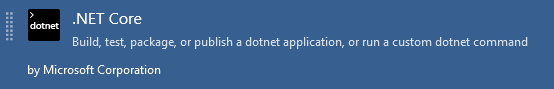
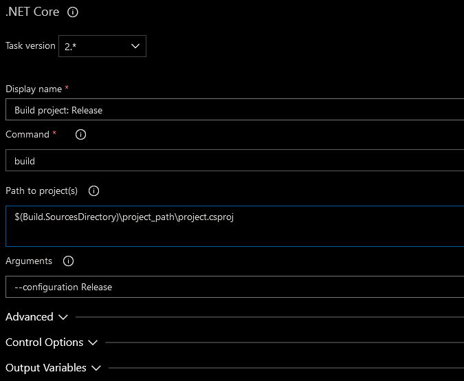
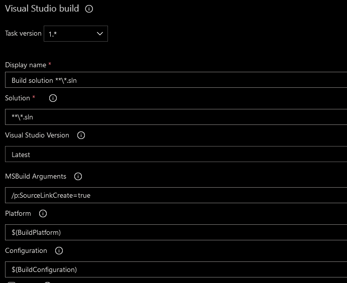
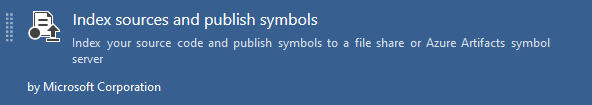
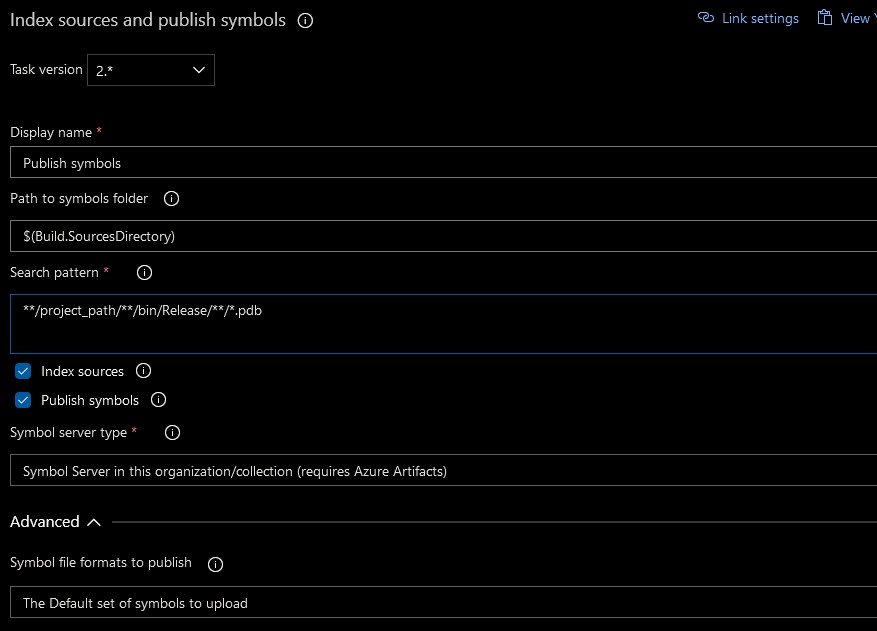
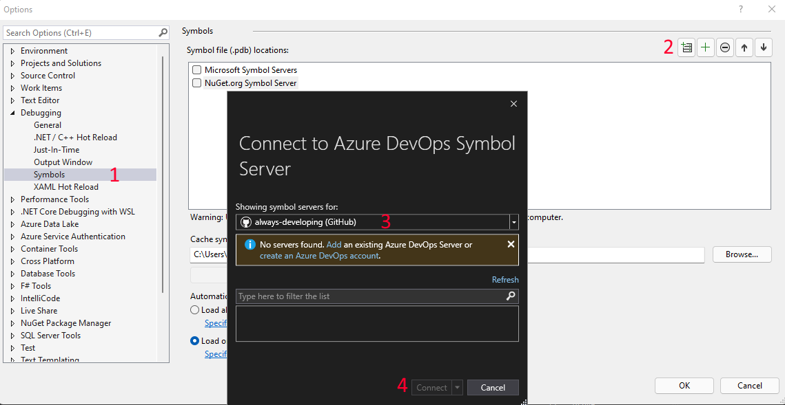
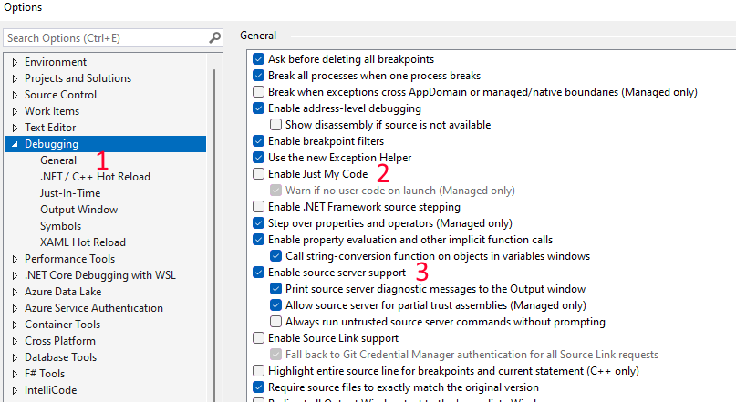
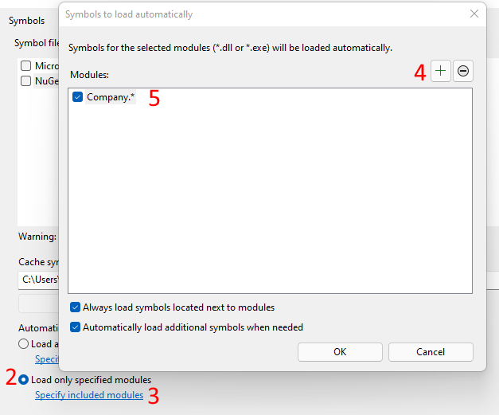

## Symbol server explained

### What are symbols?
When building a .NET project, symbol files (generally files with the extension of .pdb) are automatically created by the compiler. These symbol files contain metadata information about the source code (indexes, function names, line numbers, etc) and are used when debugging and stepping through code, by linking the debugger (e.g. Visual Studio) to the source code.

Generally, these symbol files are only available when developing locally, and building a project in debug configuration - that is, unless they are uploaded to a `symbol server`.

### What is a symbol server?
__A symbol server is a central location to store symbols__ - having the symbols available allow for the `stepping into a referenced NuGet package code` without having the source code available locally.  
The source code doesn't need to be part of the solution being built, or even on the local machine - the symbol file, made available by the symbol server will allow for full _'step into'_ debugging experience.

---

## Why use a symbol server
As mentioned above, having the symbols available via the server, allows for stepping into a referenced package's source code without having the source directly available locally. Why would one need or want this to be possible?
- `Help the package author debug and assist when issues are experienced using the package`. This is especially useful in the corporate environment where the author of a package is potentially closer to the developers and applications using the package, and is required to assist with the usage and functioning of the package.
- `Help users of the package understand in more depth what the package does and how`. Especially useful in an Open Source environment where the author of the package is most likely further removed from the user of the package. With the user of the package having the option of stepping into the package source code, it facilitates more easily understanding the package and allows for the user more easily _help themselves_ if any issues arise.

Even though each point above highlights the use case in a specific environment (corporate vs Open Source), both points can apply to either environment. 

<?# InfoBlock ?>
This post will focus on using __Azure Devops__ as a build and symbol server, but other build and symbol servers can also be used and will _mostly_ follow a similar processes to the one described in this post.
<?#/ InfoBlock ?>

---

## Producing symbols
### Configuring code

The first step in the process, is to configure the project to produce symbols with the required metadata to allow for the debugging experience.  
To do this, the required `Source Link` NuGet package must be added to the project. There are [a number of different options available](https://www.nuget.org/packages?q=Microsoft.SourceLink.), based on where the `repository is hosted`.

For a repository hosted in a Git repository in Azure Devops, a reference to `Microsoft.SourceLink.AzureRepos.Git` is added.

``` xml
<PackageReference Include="Microsoft.SourceLink.AzureRepos.Git" Version="1.1.1">
    <PrivateAssets>all</PrivateAssets>
    <IncludeAssets>runtime; build; native; contentfiles; analyzers; buildtransitive</IncludeAssets>
</PackageReference>
```

<?# InfoBlock ?>
The Source Link reference added is __required only as a development dependency__ and is only used during the build process. This is the reason the `PrivateAssets` property is set to `All` - this prevents the package consuming applications from also needing to install Source Link as a dependency.
<?#/ InfoBlock ?>

---

### Configuring CI/CD pipeline

The next step is to have the CI/CD process produce the symbols, and then upload them to the symbol server.

1. `Producing the symbols`  
Usually when developing locally, .pdb files are only generated when running in _debug configuration_, when the code is un-optimized. However, When releasing a package, it should be built in _release configuration_ with optimized code.  
With the relevant Source Link package reference added (Microsoft.SourceLink.AzureRepos.Git), the code can be built in _release configuration_ and have the symbols produced. The build can either be done using:
    - `dotnet build`:  
    Execute the **dotnet build** command with a build configuration of Release
      
    
    - `Visual Studio build`:  
    Execute the **Visual Studio build** task with build configuration of Release, and with the _MSBuild Argument_ of `/p:SourceLinkCreate=true`
      
    


1. `Publishing the symbols`:  
    The **Index sources and publish symbols** task is then used to publish the symbols to either a _file share_, or the _Azure Devops symbol server_
      
    

    Generally the publishing of artifacts would be part of the release pipeline, and not the build. However the **Index sources and publish symbols** task is `only available in the build pipeline`.

---

## Consuming symbols
### Configuring Visual Studio

The final step is to configure Visual Studio with the details on how and when to download and use the symbols. Perform the following steps in Visual Studio.

1. Configure the symbol server location:
    1. Navigate to `Tools -> Options -> Debugging -> Symbols`
    2. Click `New Azure Devops Symbol Server Location`
    3. Select the account, and a list of symbol servers available to the account will be displayed. Chose the server. (in the screen shot below, none are shown as the _always-developing_ Github account is not linked to Azure Devops)
    4. Click `Connect`



2. Configure the debugger settings:
     1. Navigate to `Tools -> Options -> Debugging`    
     1. Ensure that `Enable Just My Code` is **unchecked**
     1. Ensure that `Enable source server support` is **checked**

    


3. Configure which symbols to load automatically **(optional but recommended)**:  

    By default symbols will automatically be loaded (after being downloaded) if they are available in any of the symbol servers. If an application references a number of packages where symbols are available, start-up time when running and debugging can be dramatically negatively impacted.  
    Visual Studio can be configured to only load the packages specified - or only load packages based on a wildcard (this is incredibly useful if all NuGet packages share a common namespace structure, as might be the case especially in a corporate environment)

    1. Navigate to `Tools -> Options -> Debugging -> Symbols`
    1. Select `Load only specific modules`
    1. Click `Specify included modules`
    1. Click `New Module`
    1. Add the module name, or wildcard format

    
---

## NuGet symbol package

This post focuses on building and hosting the symbols using Azure Devops - but just a small note publishing to NuGet.org if the package is publicly available.  
The [nuget.org](http://nuget.org) symbol server uses the `.snupkg` file format for symbols, which are optionally generated when the nupkg file is generated. See this this [document on the various ways of generating a .snupkg file](https://docs.microsoft.com/en-us/nuget/create-packages/symbol-packages-snupkg).

---

## Final thoughts

That's all there is to it! 
Whether a package author or package consumer, having the option to step into the code will prove invaluable - with practically no additional development effort.

If possible (if the source code can be made public), I highly recommend making the symbols available, to everyone's benefit!

---

## References
[Symbol files](https://docs.microsoft.com/en-us/azure/devops/pipelines/artifacts/symbols?view=azure-devops)  
[Publishing symbols](https://docs.microsoft.com/en-us/azure/devops/artifacts/concepts/symbols?view=azure-devops)  
[NuGet symbols (slightly outdated, but still useful)](https://devblogs.microsoft.com/nuget/improved-package-debugging-experience-with-the-nuget-org-symbol-server/)
