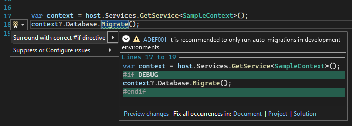

----
title: "Roslyn Analyzer - writing the code fix (Part 3)"
lead: "A step by step guide to writing an analyzer code fix"
Published: 11/26/2021
slug: "analyzer-code-fix"
draft: false
toc: true
categories:
    - Blog
    - Series
tags:
    - c#
    - .net
    - roslyn
    - codefix
    - code fix
    - analyser
    - analyzer
    - guide
    - entity framework
    - entityframework
    - ef     
    - analyzer-series    
---

All posts in the series:  
**Part 1:** [Roslyn Analyzer - explained](../analyzer-explained)    
**Part 2:** [Roslyn Analyzer - writing an analyzer](../analyzer-write/)  
**Part 3:** Roslyn Analyzer - writing a code fix (this post)  
**Part 4:** [Roslyn Analyzer - testing an analyzer and code fix](../analyzer-test/)  
**Part 5:** [Roslyn Analyzer - tips and tricks](../analyzer-extra/) 

All code in the posts, including the sample project and working `analyzer` and `code fix` are [available on Github](https://github.com/always-developing/CodeAnalysis.EntityFrameworkCore.Sample).

## Code fix introduction

As detailed in the [previous post in the series](../analyzer-write), now that there is a working `analyzer` which accurately reports diagnostic information to Roslyn, the next step is to write the `code fix` to resolve the diagnostic. 

Not all `analyzers` will have a `code fix` - the resolution might be out of the scope of Roslyn to resolve, in which case the diagnostic should info the developer how to resolve the report.

---
## Coding the code fix

### Code fix setup

First step is to configure the `code fix` so it applies to a specific diagnostic (or multiple diagnostics)

``` csharp

// The class must inherit from CodeFixProvider
[ExportCodeFixProvider(LanguageNames.CSharp, 
    Name = nameof(DevOnlyMigrateCodeFixProvider)), Shared]
public class DevOnlyMigrateCodeFixProvider : CodeFixProvider
{
    // Returns a list of the diagnostic ids this code fix will resolve
    public sealed override ImmutableArray<string> FixableDiagnosticIds
    {
        get { return ImmutableArray.Create(DevOnlyMigrateAnalyzer.DiagnosticId); }
    }

    public sealed override FixAllProvider GetFixAllProvider()
    {
        return WellKnownFixAllProviders.BatchFixer;
    }
    .
    .
    .
}
```

---

### Register the code fix

The next step is to register the code fix with Roslyn - this is done by overriding the _RegisterCodeFixesAsync_ method.

``` csharp
public sealed override async Task RegisterCodeFixesAsync(CodeFixContext context)
{
    // Gets the entire syntax tree from the context 
    var root = await context.Document.GetSyntaxRootAsync(context.CancellationToken)
        .ConfigureAwait(false);

    //  Get the first diagnostic reported, and 
    // get its Span (the location within the root syntax tree)
    var diagnostic = context.Diagnostics.First();
    var diagnosticSpan = diagnostic.Location.SourceSpan;

    // Find the syntax node at the location of the diagnostic 
    var declaration = root.FindToken(diagnosticSpan.Start).Parent.
        AncestorsAndSelf().OfType<InvocationExpressionSyntax>().First();

    // Register a code action that will invoke the fix.
    // This include the text which appears in the quick action menu and 
    // the method to call which will handle altering the document
    context.RegisterCodeFix(
        CodeAction.Create(
            equivalenceKey: DevOnlyMigrateAnalyzer.DiagnosticId,
            title: "Surround with correct #if directive",
            createChangedDocument: c => 
                InsertIfDirectiveAsync(context.Document, declaration, c)),
        diagnostic);
}
```

---

### Alter the syntax tree

A `code fix` consists of taking the original document (which contains the full context tree), modifying various nodes in the tree to reflect how the fixed code should look, and then returning the updated document.  

For the sample `analyzer`, this is done in _InsertIfDirectiveAsync_, the method registered in the previous step:

``` csharp

// The parameters to the method are the full Document, 
// as well as the specific syntax which triggered the diagnostic
private async Task<Document> InsertIfDirectiveAsync(Document document, 
    InvocationExpressionSyntax invocationExpr, CancellationToken cancellationToken)
{
    var memberAccessExpr = invocationExpr.Expression as MemberAccessExpressionSyntax;
    var originalRoot = await document.GetSyntaxRootAsync(cancellationToken);

    // A helper method is called to get the code statement which 
    // invocationExpr (Migrate method call) is part of. 
    // The statement is the larger code block containing the invocationExpr, 
    // _context?.Database.Migrate() in this case
    var statement = GetStatement(invocationExpr);

    // A helper method is called to get the closest #if directive 
    // which occurs before the invocationExpr location 
    var closestIfDirective = CodeAnalysisHelper.GetClosestIfDirective(memberAccessExpr, 
        originalRoot);

    // if there was one
    if (closestIfDirective != null)
    {
        // work out the replacement directive and replace 
        var replacementIfDirective = SyntaxFactory.IfDirectiveTrivia(
            SyntaxFactory.ParseExpression($" DEBUG{Environment.NewLine}"), 
            true, true, true);

        var replacementIfDirectiveList = SyntaxFactory.TriviaList(new SyntaxTrivia[]
        {
            SyntaxFactory.Trivia(replacementIfDirective)
        });

        // Find the existing trivia in the statement node
        var ifDirectiveNode = statement.FindNode(closestIfDirective.Value.Span);

        if(ifDirectiveNode != null && ifDirectiveNode.HasLeadingTrivia)
        {
            // Replaces the text in the #if directive, then replace the directive 
            // in the statement with the new directive, then replaced the 
            // statement in the root with the new statement  
            var newIfDirectiveNode = ifDirectiveNode
                .WithLeadingTrivia(replacementIfDirectiveList);
            var newReplacementStatement = statement
                .ReplaceNode(ifDirectiveNode, newIfDirectiveNode);
            var newReplacementRoot = originalRoot
                .ReplaceNode(statement, newReplacementStatement);

            return document.WithSyntaxRoot(newReplacementRoot);
        }

        return document;
    }

    // This handles inserting a new #if directive into the statement (InsertNewIfDirective 
    // method), and then returns the document with the newly inserted directive.
    var statementWithDirective = InsertNewIfDirective(statement);
    var newRootWithEndDirective = originalRoot
        .ReplaceNode(statement, statementWithDirective);

    return document.WithSyntaxRoot(newRootWithEndDirective);
}
```

---

### Applying the code fix

Nothing more is required - Visual Studio and Roslyn will automatically call the `code fix` method to:
1. Give a preview of the fix being applied when the cursor is held over the quick action menu item.
1. Apply the fix when the quick action menu item is clicked.



---

## Next steps: Testing the analyzer and code fix

Next up, [part 4 in the series](../analyzer-test/) will detail how to test the custom `analyzer` and associated `code fix`. This includes information on using the analyzer `unit tests infrastructure` to assist with development, as well as using the `VSIX` project.

## Useful links
[Roslyn repository](https://github.com/dotnet/roslyn)  
[Sample analyzer and code fix repository](https://github.com/always-developing/CodeAnalysis.EntityFrameworkCore.Sample)
