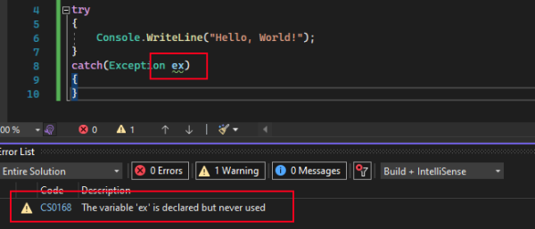
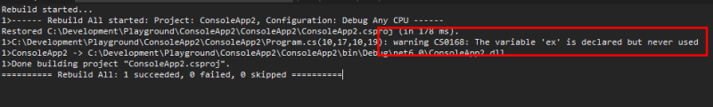
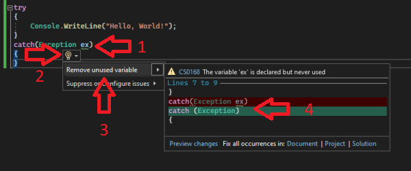

## Series introduction

This is a a five part series exploring the Roslyn analyzer and code fix functionality, how to successfully write and test a custom analyzer, as well as some useful tips and tricks for writing analyzers.

All posts in the series:  
**Part 1:** Roslyn Analyzer - explained (this post)  
**Part 2:** [Roslyn Analyzer - writing an analyzer](../analyzer-write/)  
**Part 3:** [Roslyn Analyzer - writing a code fix](../analyzer-code-fix/)  
**Part 4:** [Roslyn Analyzer - testing an analyzer and code fix](../analyzer-test/)  
**Part 5:** [Roslyn Analyzer - tips and tricks](../analyzer-extra/) 

All code in the posts, including the sample project and working `analyzer` and `code fix` are [available on Github](https://github.com/always-developing/CodeAnalysis.EntityFrameworkCore.Sample).

## What is Roslyn?
In short, `Roslyn` is the .NET compiler - it consists of the compilers for C# and Visual Basic, as well as an api layer which can be leveraged to gather information about the code (`analyse`), and then perform actions based on this information (`code fix`).

---

## What is a Roslyn analyzer?
An `analyzer` is a piece of code which inspects code (C# or Visual Basic) during design and compile time, and based on the results of the inspection, can raise a **diagnostic result** as an **Error, Warning** or as **Information**.  

All installed and built-in `analyzer(s)` are run at design time (and compile time) automatically, with the diagnostic results reflecting: 
- As coloured "squiggles" in code
- In the **Error List** (Ctrl+W, E) in Visual Studio
- In the build output





An `analyzer` can be leveraged to inspect code for a number of issues related to (but not limited to):
- Style
- Quality
- Design
- Maintainability

As `Roslyn` exposes an API layer on top of the compiler, this layer can be used to write a custom `analyzer`.  

[See part 2 for more in depth details regarding writing a custom analyzer.](../analyzer-write/) 

---

## What is a Roslyn analyzer code fix?
Once an `analyzer` has inspected the code and returned an diagnostic result, the next step is apply a code change to resolve the source of the alert - `a code fix`.  

An `analyzer` does not require a `code fix`, but if no `code fix` is provided then it is up to the developer to resolve the issue manually based on the **error, warning or information** message.

If the `analyzer` does have an associated `code fix`, it can be accessed using these steps:
1. Hover or place the cursor over the squiggle, a _light bulb_ will appear
2. Select the small arrow next to the _light bulb_, or (Ctrl+.) to see available fix suggestions
3. Hover the cursor over one of the suggestions in the list
4. A preview of how the code will be changed when the `code fix` is applied is displayed
4. Select one of the suggestions to apply the `code fix`



[See part 3 for more in depth details regarding writing a code fix for a custom analyzer.](../analyzer-code-fix/) 

---

## Why write an analyzer?

A few reasons or use cases for writing a `custom analyzer`:
1. To monitor and diagnose more niche coding patterns you, as a developer, constantly gets wrong or have to look up (`analyzers` already exist for most common best practices)
2. As a library author (publishing a library to NuGet, for example) an `analyzer` can be packaged with the library (see the section below) to ensure that it is used correctly by the developer.
3. To ensure common coding practices and styles are shared across all development teams in an organization.

---

## Sharing a custom analyzer

There are two ways to share a `custom analyzer` once it has been written:
1. **VSIX**: The `analyzer` can be packaged as a vsix, a Visual Studio Extension. This is an executable file which can be either be shared and manually installed by the developer, or can be downloaded [Visual Studio Marketplace.](https://marketplace.visualstudio.com/vs).
2. **NuGet package**: An `analyzer` can be package into a NuGet package and installed into a project via a NuGet store (such as [nuget.org](https://www.nuget.org/) or an internal NuGet store in the case of a company specific `analyzer`)

---

## Analyzers are tricky!

It can be very tricky getting the `analyzer` to accurately detect the relevant scenarios in code, and just as hard to fix it accurately with a `code fix` - syntax trees are complex. (more on this later in the series: [part 2](../analyzer-write/), [part 3](../analyzer-code-fix/) and [part 4](../analyzer-test/))  

On top of that, the developer experience for `analyzers` are not as slick and friendly as with other tooling. The debugging experience for `analyzers` are inconsistent and not always responsive, while the apis exposed to assist with testing an analyzer can be complicated and difficult to configure.

But all is not lost - it is possible to work with and around the above constraints (with tips from this series of posts) and still successfully create your own custom `analyzer`.

---

## A working sample analyzer

The guides in [part 2](../analyzer-write/) and [part 3](../analyzer-write/) will detail how to write an `analyzer` package which inspects the code, and applies a `code fix` for the following two scenarios related to Entity Framework Core (an understanding of Entity Framework Core is not required to understand the analyzers):

1. Ensure code migrations are not automatically applied in the Test or Production environment
2. Ensure the correct appsettings.json section has been added an Entity Framework Core database connection is configured in code

### Scenario 1: auto-migrations

Entity Framework Core (EF) is an ORM which provides build in data-access functionality to perform operations on a database. What is important for these posts, is to know that EF provides functionality to scaffold and update the schema of the database (the tables etc) at runtime, usually at startup.  

However it is recommended to only run this migration on development environments, and not in test or production environments. Usually CI/CD pipeline executes the database migration in these environments (which also allows for review of the migration script before it being applied to the database)

The custom `analyzer` will look for the presence of the migration code (a _.Database.Migrate_ method call), and ensure it is only executed when the code is run in DEBUG configuration.

### Scenario 2: connection string

When configuring EF, a database connection name is specified, with the actual connection string stored in the appsettings.json settings file.

``` csharp
.AddDbContext<SampleContext>(x => x
    .UseSqlite(context.Configuration.GetConnectionString("SampleDatabase")))
```

This code relies on the connection string being present in the appsettings.json file:

``` json
{
    "ConnectionStrings": {
        "SamplesDatabase": "Data Source=LocalDatabase.db"
    }
}
```

The custom `analyzer` will inspect the appsettings.json file and ensure the connection string is present and correct.

---

## Next steps: Writing the analyzer

Next up, [part 2 in the series](../analyzer-write/) will go into detail and expand on coding a custom `analyzer`.

---

## Useful links
[Entity Framework Core](https://docs.microsoft.com/en-us/ef/core/)  
[Roslyn repository](https://github.com/dotnet/roslyn)  
[Sample analyzer and code fix repository](https://github.com/always-developing/CodeAnalysis.EntityFrameworkCore.Sample)

