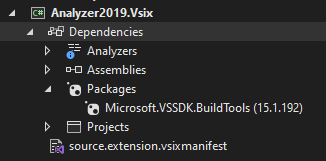
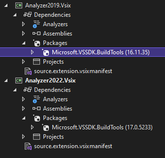
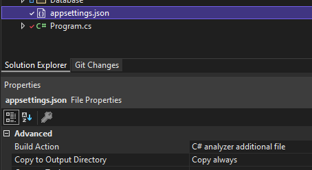

All posts in the series:  
**Part 1:** [Roslyn Analyzer - explained](../analyzer-explained)    
**Part 2:** [Roslyn Analyzer - writing an analyzer](../analyzer-write/)  
**Part 3:** [Roslyn Analyzer - writing a code fix](../analyzer-code-fix/)  
**Part 4:** [Roslyn Analyzer - testing an analyzer and code fix](../analyzer-test/)  
**Part 5:** Roslyn Analyzer - tips and tricks (this post) 

All code in the posts, including the sample project and working `analyzer` and `code fix` are [available on Github](https://github.com/always-developing/CodeAnalysis.EntityFrameworkCore.Sample).

## Tips and tricks

This post contains a list of tips and tricks, work-around's and other bits of (what I find) useful information to aid in developing `analyzers`.

---

### Analyzer tips and tricks

#### Compatibility

If an analyzer is created in Visual Studio 2019 using the `Analyzer with Code Fix` project - it will not be initially compatible with Visual Stdio 2022 (or visa versa).  
The actual `analyzer` and `code fix` code itself is compatible (as its .NET Standard 2.0), however the VSIX project is not compatible 



To have the VSIX project work in Visual Studio 2022, the `Microsoft.VSSDK.BuildTools` reference needs to be updated to version 17. However doing so will mean it will no longer be supported in Visual Studio 2019.

To have the analyzer work in both Visual Studio 2019 and Visual Studio 2022, two VSIX projects need to be created in the solution. One will be for Visual Studio 2019 and have a `Microsoft.VSSDK.BuildTools` reference of version `15 or 16`, and the other for Visual Studio 2022 with a `Microsoft.VSSDK.BuildTools` reference of `17`.



---

#### Syntax tree 

Sometimes when using the `Syntax Visualizer`, detailed in the section [Writing an analyzer - interrogate the syntax tree](../analyzer-explained), the tree in the `Syntax Visualizer` windows stops refreshing when selecting items in the code, and will appear blank.  

To force a refresh of the window, make a small code change - for example, add a remove a semi-colon in code. This will force the window to refresh and the syntax tree will appear and refresh correctly (until the next time it stops working).

---

#### Additional files

While an `analyzer` can inspect non-code files (such as the appsettings.json in the sample), these "additional files" are not included as part of the Roslyn checks by default. A file has to specifically be marked as an additional file for Roslyn to be able to work with it.  
This is done by specifying the files `Build Action` to be `C# analyzer additional file` on the file's `Properties` window in Visual Studio.



When an `analyzer` is dependent on the additional file being present, as is the case in the sample analyzer, then a diagnostic can be raised if the additional file cannot be found.

In the below example, the `ADEF002` diagnostic is raised if the `appsettings.json` hasn't been included as an additional file - if it doesn't have a build action of `C# analyzer additional file`.

``` csharp
// if there is no file to query, then report a diagnostic
if (context.Options.AdditionalFiles == null || 
    !context.Options.AdditionalFiles.Any(x => x.Path
        .EndsWith("appsettings.json", StringComparison.OrdinalIgnoreCase)))
{
    var diagnostic002 = Diagnostic.Create(rule002, Location.None);
    context.ReportDiagnostic(diagnostic002);

    return;
}
```

---
### Code fix tips and tricks

#### Modify non-code

While it is possible to have an `analyzer` inspect non-code files (such as the appsettings.json in the sample), it is not possible to have the `code fix` modify these files. The `code fix` is only able to modify the syntax tree, which a non-code file will obviously not have.

A solution to this is the demonstrated in the sample `analyzer`. Diagnostic `ADEF003` ensures that the connection string name specified in code exists in the appsettings.json file. As an `analyzer` can inspect the json file, it is successfully able to trigger the diagnostic, however the associated `code fix` is unable to modify the json.  

Instead, a comment snippet is inserted above the offending code block, with the correct json, and a message informing the developer what to do with it.

In the below example, no connection string called _SampleDatabase_ was present in the appsettings.json, so a diagnostic was triggered.

Before `code fix` has been applied:
``` csharp
.ConfigureServices((context, services) => services
        .AddDbContext<SampleContext>(x => x
            .UseSqlite(context.Configuration.GetConnectionString("SampleDatabase")))
).Build();
```

After `code fix` has been applied:
``` csharp
.ConfigureServices((context, services) => services
    /* Ensure the below JSON snippet exists in appsettings.json.
    {
            "ConnectionStrings": {
                    "SampleDatabase": "Data Source=LocalDatabase.db"
            }
    }
    */
    .AddDbContext<SampleContext>(x => x
        .UseSqlite(context.Configuration.GetConnectionString("SampleDatabase")))
).Build();
```

This `code fix` however does not fully resolve the diagnostic. Only once the json snippet has been manually copied in the appsettings.json file by the developer will the `analyzer` stop reporting the diagnostic.

---

### Unit test tips and tricks

#### VSIX debugging

Using the VSIX project, which is part of the `analyzer` template, is a critical tool to test and debug an `analyzer`, and see how it performs in an Visual Studio instance (vs running units tests to ensure the functionality is correct). However occasionally when running the VSIX project, the updated version of the `analyzer` does get installed/loaded into the debugging Visual Studio instance.

Performing one of these two options usually resolves the issue:
- Explicitly build/rebuild each project in the `analyzer` solution before running the `analyzer` VSIX project. 
- Delete the cache for the debug Visual Studio instance. The cache is stored in the user folder: `C:\Users\username\AppData\Local\Microsoft\VisualStudio\xxxxRoslyn`.  

    Deleting this cache will removing any settings, cache for the debug Visual Studio instance, and the next time its opened it will be as if it was the first time, and the updated version of the extension will be installed for the "first time". 

---

### Series Finale

The series of posts have hopefully given enough base information to give a basic understand of what an `analyzer` and `code fix` are, what the various components are and how they fit together, and how they can successfully be tested using a number of methods.

The source code for full working `analyzer` and `code fix`, as well as the sample application is all [available on Github](https://github.com/always-developing/CodeAnalysis.EntityFrameworkCore.Sample).