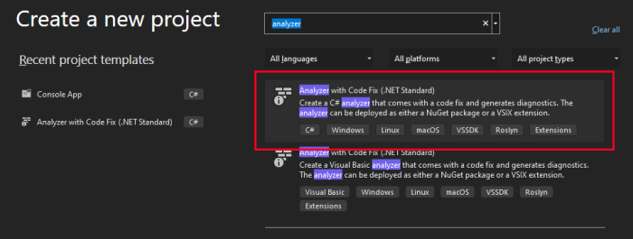
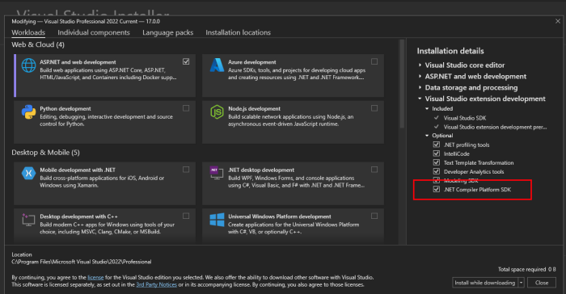
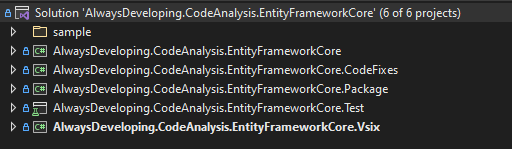
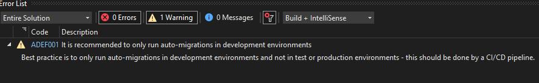
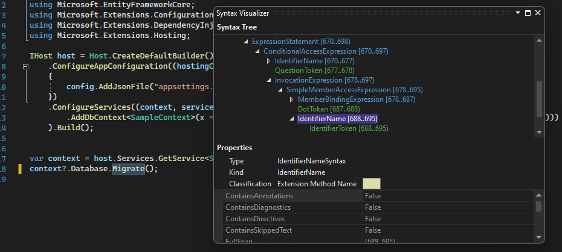

All posts in the series:  
**Part 1:** [Roslyn Analyzer - explained](../analyzer-explained)    
**Part 2:** Roslyn Analyzer - writing an analyzer (this post)  
**Part 3:** [Roslyn Analyzer - writing a code fix](../analyzer-code-fix/)  
**Part 4:** [Roslyn Analyzer - testing an analyzer and code fix](../analyzer-test/)  
**Part 5:** [Roslyn Analyzer - tips and tricks](../analyzer-extra/) 

All code in the posts, including the sample project and working `analyzer` and `code fix` are [available on Github](https://github.com/always-developing/CodeAnalysis.EntityFrameworkCore.Sample).

## Analyzer introduction

To recap from the [previous post in the series](../analyzer-explained), an `analyzer` is a piece of code which inspects code (C# or Visual Basic) during design and compile time, and based on the results of the inspection, can trigger a **diagnostic** as an **Error, Warning** or as **Information**.  

This post will detail the various parts of the `analyzer`, how they fit together, and then explore creating a custom `analyzer`.

<?# InfoBlock ?>
While the samples used in these posts and in the associated [Github repository](https://github.com/always-developing/CodeAnalysis.EntityFrameworkCore.Sample) are working and practical, the code is NOT optimized, and also does not cater for all use cases scenarios and edge cases.  
The code should be used as a guide for writing a custom `analyzer` and `code fix` and not as-is for production use.
<?#/ InfoBlock ?>

---

## Analyzer solution
### Creating an analyzer project

Creating the initial analyzer project is very simple - Visual Studio has a template for it!  
When creating a new project in Visual Studio, search for _analyzer_ and select the C# *Analyzer with Code Fix (.NET Standard)* template.



If the project doesn't appear in the list, the .NET Compiler Platform SDK workload is most likely not installed. Modify the Visual Studio installation to confirm and install if required.



<?# InfoBlock ?>
The various analyzer projects will be created with the target framework of .NET Standard 2.0 for the analyzer specific projects, and .NET Framework 4.7.2 for the VSIX project.  
These should remain as is - as Visual Studio was written using .NET Framework, extensions are required to target .NET Standard 2.0 and currently cannot target any later framework.
<?#/ InfoBlock ?>

---

### Structure of the solution

The default analyzer template will create 5 projects as part of the solution (in the order as they appear in the screenshot below):  
1. A project which contains the `analyzer` code
2. A project which contains the `code fix` code
3. A project used to create a NuGet package for the analyzer
4. A test project containing unit test (which is also invaluable for debugging while developing)
5. A VSIX project which creates the Visual Studio extension (also invaluable for testing while developing) 



---

## The analyzer
### A sample application

Before starting to code the analyzer, a **_very strong_** suggestion is to create a small sample application which contains the scenario to trigger the `analyzer`. 
This will be very useful when testing, as well as crucial when working out the syntax tree of the code (more on this below).  

This sample project does not have to be at all complicated - the sample project ([available on Github](https://github.com/always-developing/CodeAnalysis.EntityFrameworkCore.Sample)) just creates a connection to a Sqlite database, and applies a database migration. No other logic.

Personally I prefer to add the sample to my analyzer solution (useful when using the Syntax Visualizer), but then also create a separate solution which just contains just the sample project (useful when testing the analyzer as an extension).

See [part 1 for a more in depth breakdown](../analyzer-explained) of the the scenarios the custom `analyzers` are reporting on.

---

### Coding the analyzer
#### Analyzer structure

An analyzer class inherits from the `DiagnosticAnalyzer` class, and can be broken down into four parts:
1. **The diagnostic setup**: Configure the diagnostic information which appear when the analyzer reports feedback back to the developer
2. **Register the action**: An Action (a method) is registered, along with a specific syntax kind (e.g. MethodInvocations or NamedTypes). The action/method will then be invoked whenever Roslyn encounters a syntax of that kind while running analysis.
3. **Interrogate the syntax tree**: Once Roslyn calls the action/method setup in step 2, the syntax tree/code structure is interrogated to determine if the code is relevant for the `analyzer` and does a diagnostic need to be trigger
4. **Trigger the diagnostic result**: The final step is to trigger a diagnostic with Roslyn so the results can be reported back

---

#### Diagnostic setup

The first step is to setup the diagnostic information, the information which is reported back.  

The template makes use of a resx file to allow for localization, however in the sample code [on Github](https://github.com/always-developing/CodeAnalysis.EntityFrameworkCore.Sample) as well as in the example below, the resx has been removed and the messages put directly in code.

``` csharp
// The unique identifier for the diagnostic being triggered 
public const string DiagnosticId = "ADEF001";

// The title for the diagnostic  
private static readonly string Title = "Release build auto-migration";
// The message for the diagnostic
private static readonly string MessageFormat = "It is recommended to only " + 
    "run auto-migrations in development environments";

private static readonly string Description = "Best practice is to only run "+ 
    "auto-migrations in development environments and not " + 
    "in test or production environments - this should be done by a CI/CD pipeline.";

// The category for the diagnostic (the type of analyzer - for example the default
// template analyzer has a category of 'Naming')
private const string Category = "Usage";

// Creates the actual rule using the information defined above
private static readonly DiagnosticDescriptor rule001 = 
    new DiagnosticDescriptor(DiagnosticId, Title, 
    MessageFormat, Category, DiagnosticSeverity.Warning, 
    isEnabledByDefault: true, description: Description);

// Exposes the rules the `analyzer` could potentially report 
// (a single analyzer could trigger multiple types of diagnostic)
public override ImmutableArray<DiagnosticDescriptor> SupportedDiagnostics 
    { get { return ImmutableArray.Create(rule001); } }

```

The diagnostic is now represented as follows:



---

#### Register the action

The next step is to register an action to be called when Roslyn finds a the type of code (syntax kind) the analyzer is interested in.  

This is done in the overridden _Initialize_ method.

``` csharp
public override void Initialize(AnalysisContext context)
{
    // Default configuration. For most `analyzers` this does not need to be changed
    context.ConfigureGeneratedCodeAnalysis(GeneratedCodeAnalysisFlags.None);
    context.EnableConcurrentExecution();

     // This is the important line, which registers the `AnalyzeExpression` method 
     // to be called when Roslyn finds a piece of code which
     // is of type `InvocationExpression` (a method call).
    context.RegisterSyntaxNodeAction(AnalyzeExpression, SyntaxKind.InvocationExpression);
}
```

There are a large number of `SyntaxKinds` which can be used to trigger a call to the action method.

The `analyzer` is starting to take form, with the details of the rule defined, as well as an action registered, to be called when the `syntax kind` in question is found by Roslyn.

---

#### Interrogate the syntax tree

See the ["Working Sample Analyzer"](../analyzer-explained/#a-working-sample-analyzer) section in the previous post for more information regarding what this customer `analyzer` is  doing. In short though, the `analyser` is looking for a very specific method called _Migrate_ on a parent called _Database_ (so _Database.Migrate()_), which should only be called in debug configuration.

This is where most of the `analyzer` work happens - the syntax node and syntax tree are interrogated to determine if the diagnostic should be triggered or not.  

``` csharp
private static void AnalyzeExpression(SyntaxNodeAnalysisContext context)
{
    // We know the node is of type InvocationExpressionSyntax as the callback
    // registration was only for SyntaxKind.InvocationExpression
    var invocationExpr = (InvocationExpressionSyntax)context.Node;

    // InvocationExpr.Expression is the method name, the expression before "(". 
    // In our case Database.Migrate
    var memberAccessExpr = invocationExpr.Expression as MemberAccessExpressionSyntax;
    if (memberAccessExpr == null)
        return;

    // Get the expression. In our case, Database
    var bindingExpression = memberAccessExpr.Expression as MemberBindingExpressionSyntax;
    if (bindingExpression == null)
        return;

    // Get the memberAccessExpr name of the expression.
    // In our case, Migrate
    var expressionName = bindingExpression.Name as IdentifierNameSyntax;
    if (expressionName == null)
        return;

    // If we reach this far, make sure its the Database property
    if (expressionName.Identifier.ToString().ToLower() != "Database".ToLower())
        return;

    // Get the memberAccessExpr name of the expression.
    // In our case, Migrate
    var identifierName = memberAccessExpr.Name as IdentifierNameSyntax;
    if (identifierName == null)
        return;

    // check if its the specific method we want to analyze
    if (identifierName.Identifier.ToString().ToLower() == "Migrate".ToLower())
    {
        // A helper method is called to find the closest 
        // `#if directive` which occurs before the **Database.Migrate()** call
        var closestIfDirective = CodeAnalysisHelper.GetClosestIfDirective(
                memberAccessExpr, context.SemanticModel.SyntaxTree.GetRoot());
        if (closestIfDirective != null)
        {
            // A helper method is called to check if the
            // `#if directive` contains a valid condition
            if(CodeAnalysisHelper.IsValidIfDirective(closestIfDirective))
            {
                return;
            }
        }

        // report the error if we found the method and it didn't have the 
        // directives expected
        var diagnostic001 = Diagnostic.Create(rule001, identifierName.GetLocation());
        context.ReportDiagnostic(diagnostic001);
    }
}
```

As the `AnalyzeExpression` method is called every time the syntax kind registered (_InvocationExpression_ in this case) is found in code, the analyzer needs to ignore any _InvocationExpression_'s which are not relevant to it.

These step can be very tricky to get right, and sometimes requires a lot of trial and error and debugging to get right. Working with the syntax tree can be complex depending on what the `analyzer` is looking for.  

However the `Syntax Visualizer` does make it easier.

This is an iterative process, using the below three methods to debug, inspect the code and syntax tree, and making tweaks to the various `analyzer` checks:
- Use of the `Syntax Visualizer`
- Use of the `unit test infrastructure` for analyzers
- Executing the `VSIX project` (which starts up a new instance of Visual Studio with the analyzer installed as an extension)

---

##### The Syntax Visualizer

Visual Studio comes with a built in tool window called the `Syntax Visualizer`, which can be found under the `View -> Other Windows -> Syntax Visualizer`.

This window will track the current active code window, and display the syntax tree of the active code, in a hierarchical structure.  
Selecting various pieces of the code will cause the highlighted item in the `Syntax Visualizer` to change and track the active item in code. 

This is invaluable in determining which `SyntaxKind` to register (as described in the ["register the action"](#register-the-action) section ), as well as how to traverse the tree to find the relevant syntax nodes to trigger the diagnostic being registered.  

The `Syntax Visualizer` + the sample project created in the ["creating an analyzer project"](#creating-an-analyzer-project) section, are key in correctly determining the logic of the analyzer. The below screen shot show the `Syntax Visualizer` reflecting the part of the `syntax tree` for the **Migrate()** method.  

Notice how the tree matches the checks done in the code in the [above section:](#interrogate-the-syntax-tree):  
    `InvocationExpression -> MemberAccessExpression -> MemberBindingExpression -> IdentifierName`



---

#### Trigger the diagnostics

Once the code has been interrogated and it has been determined feedback needs to be given, the final step is to trigger and register the diagnostic with Roslyn.  

The diagnostic information and rule created in ["diagnostic setup"](#diagnostic-setup), is reported at a specific location.

``` csharp
// The diagnostic is created, with a specific rule and a specific location. 
// This location will be where the squiggle appears in code when the diagnostic is triggered.  
var diagnostic001 = Diagnostic.Create(rule001, identifierName.GetLocation());

// The diagnostic is finally triggered with Roslyn.
context.ReportDiagnostic(diagnostic001);
```

## Next steps: Coding the code fix

Next up, [part 3 in the series](../analyzer-code-fix/) will go into detail and expand on coding the `code fix` for our analyzer, which will fix the code the `analyzer` has determined to be incorrect.

---

## Useful links
[Roslyn repository](https://github.com/dotnet/roslyn)  
[Sample analyzer and code fix repository](https://github.com/always-developing/CodeAnalysis.EntityFrameworkCore.Sample)