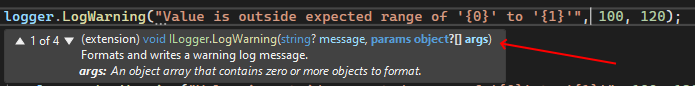

## Daily Knowledge Drop

When performing logging using the ILogger interface, to have more effective memory usage, ensure to `check if logging is enabled for the relevant log level` before calling the log method.

For example:

❌ Don't do this:
``` csharp
    logger.LogWarning("Value is outside expected range of '{0}' to '{1}'", 100, 120);
```

✅ Do this:
``` csharp
if(logger.IsEnabled(LogLevel.Warning))
{
    logger.LogWarning("Value is outside expected range of '{0}' to '{1}'", 100, 120);
}
```

Both examples will:
- **Output the message** if the _Warning_ log level is enabled
- **Not output the message** if the _Warning_ log level is not enabled, for example if the _Default_ log level in the appsettings.json has been set to _Error_.

The resulted output in both examples are the same, the message output when _Warning_ log level is enabled, and the message is not output when the _Warning_ log level is disabled - so `why even do the additional IsEnabled check?`

---

## Why check?

Internally, the ILogger implementation will check if the requested log level (warning in the above examples) is enabled or not and output the message accordingly.

The problem with this, and the above examples, is the way in which the parameters are passed int the _Log_ methods.  
As you can see below, the method takes the message and then parameters as an object array:

 

Why is this not ideal?  

In the above examples, the two parameter values (100 and 120) are integers which are store on the stack. However when sent to the method as parameters, they are boxed into objects which are then stored on the heap. This boxing means additional memory needs to be allocated, and also means this additional memory needs to be cleaned up by the garbage collector as some point.

Including the _logger.IsEnabled_ call will ensure `the Log method is not called, the parameters are never boxed, and the additional memory is never allocated`.

Will this make a fundamental difference when outputting one warning message as in the above example? No.  
Will this make a fundamental difference when outputting thousands or tens of thousands of messages in your application? Probably

At least now with this knowledge, you can make an informed decision whether the additional checks are required or not for your specific use case. As always, if unsure benchmark the results (using BenchmarkDotNet for example) for your use case.

---

## Notes

There are other potentially better ways to do logging - for example, this post on [Structured logging using Serilog](https://www.alwaysdeveloping.net/p/01-2022-structured-logging/) describes the problems when traditional logging, and how to implement Serilog to improve the logging experience.  

However, if you are currently using the default ILogger implementation, consider the above examples and the impact on memory.

---

## References
[You are doing .NET logging wrong. Let's fix it](https://www.youtube.com/watch?v=bnVfrd3lRv8)

<?# DailyDrop ?>01: 01-02-2022<?#/ DailyDrop ?>