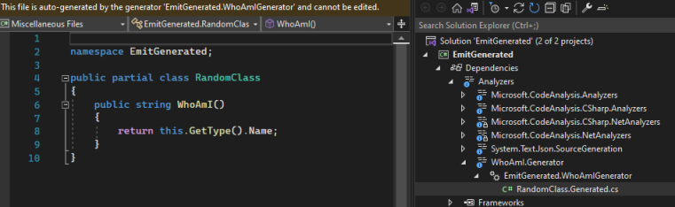
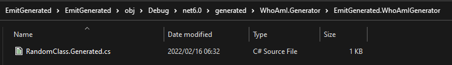
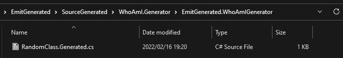

## Daily Knowledge Drop

The output location of code created by a `Roslyn source generator` can be customized, so that the output file can be included in source control (to be included in code reviews for example).

This post will give a brief overview of source generators, and then show the default behavior and how it can be customized. 

This post will not go into detail regarding the finer details of source generators - if you would like more details on source generators, see the reference links below.

---

## Source generators

In short, a source generator is a piece of `code which writes code`. The functionality ships as part of _Roslyn_, the .NET Compiler Platform SDK.

Source generators allow for the inspection of user code as _compile time_, and then based on specific criteria, can add additional code to the original code base, on the fly.

Let's look at a very simple example, and all it's moving parts. In the example, `based on an attribute being present on a class, an additional method called "WhoAmI" will be added to the class, which will return the class the method is a member of`.  

This code is very basic and by no means production ready.

---

### Define the qualifier

For a class to qualify for the new _WhoAmI_ method, it will need to be decorated with an attribute - so first the attribute is defined. This is not specific to source generators, just a normal C#attribute.

``` csharp
[AttributeUsage(AttributeTargets.Class)]
public class WhoAmIAttribute : Attribute 
{
    public WhoAmIAttribute() { }
}
```

---

### Find qualifying classes

The next step is to setup the rule to find qualifying classes. This is done using an _ISyntaxReceiver_ implementation. Roslyn will parse the entire code base and for each separate syntax node (each part of code) will call the _ISyntaxReceiver_ implementation.

``` csharp
public class WhoAmISyntaxReceiver : ISyntaxReceiver
{
    // This is to store the class which qualified
    public ClassDeclarationSyntax QualifyingClass { get; private set; }

    public void OnVisitSyntaxNode(SyntaxNode syntaxNode)
    {
        // check the type of node, and if its not a ClassDeclaration, 
        // ignore as it will automatically not qualify
        if (syntaxNode is ClassDeclarationSyntax cds)
        {
            // check if the class is decorated 
            // with an attribute called "WhoAmI"
            if (cds.AttributeLists.SelectMany(al => 
                    al.Attributes.Where(a => 
                        a.Name.ToString().Equals("WhoAmI", 
                            StringComparison.InvariantCultureIgnoreCase)
                    )).Any())
            QualifyingClass = cds;
        }
    }
}
```

**This implementation, as well as the generator are created in a separate project called _WhoAmI.Generator_.**

---

### Generate the code

Next, is to setup the actual generator. The generator will received input from the _ISyntaxReceiver_ implementation, generate the code as a string, and then output a C# file.

``` csharp
[Generator]
public class WhoAmIGenerator : ISourceGenerator
{
    public void Execute(GeneratorExecutionContext context)
    {
        WhoAmISyntaxReceiver syntaxReceiver = 
            (WhoAmISyntaxReceiver)context.SyntaxReceiver;

        // Get the qualifying class from the receiver
        ClassDeclarationSyntax qualifyingClass = syntaxReceiver.QualifyingClass;
        if (qualifyingClass is null)
        {
            return;
        }

        // Generate the required code as a string
        SourceText sourceText = SourceText.From($@"
namespace EmitGenerated;

public partial class {qualifyingClass.Identifier}
{{
    public string WhoAmI()
    {{
        return this.GetType().Name;
    }}
}}", Encoding.UTF8);

        // Output the C# file with the given name and code
        context.AddSource($"{qualifyingClass.Identifier}.Generated.cs", sourceText);
    }

    public void Initialize(GeneratorInitializationContext context)
    {
        // register the generator to receive notification from WhoAmISyntaxReceiver
        context.RegisterForSyntaxNotifications(() => new WhoAmISyntaxReceiver());
    }
}
```

**This implementation, as well as the receiver mentioned above, are created in a separate project called _WhoAmI.Generator_.**

---

### Project Reference

Now we have to register the generator in the main project. The _WhoAmI.Generator_ project (which contains the generator and the receiver) can be referenced as a normal _Project Reference_ initially. However, the csproj then needs to be edited to indicate that the referenced project is a generator and not a normal project reference.  

The _OutputItemType_ and _ReferenceOutputAssembly_ values are added. The relevant section in the csproj file will look as follows:

``` xml
<ItemGroup>
    <ProjectReference Include="..\WhoAmI.Generator\WhoAmI.Generator.csproj" 
        OutputItemType="Analyzer" ReferenceOutputAssembly="false" />
</ItemGroup>
```


---

### Implement and output

Finally, it's time to use the generator.

A partial class is created, and decorated with the attribute:

``` csharp
[WhoAmI]
public partial class RandomClass { }
```

Even though the class doesn't directly contain a method called _WhoAmI_, the generator will create the method in a separate file (which is allowed as the class is partial):

``` csharp
var rc = new RandomClass();
Console.WriteLine(rc.WhoAmI());
```

The output:


``` powershell
    RandomClass
```

We are now able to call the _WhoAmI_ method to find out the type.

### Limitations

The advantage of generators is that the code is automatically generated at _compile time_, however the side-effect of this is that the code is not emitted to a file on disk. The only way to see the code generated it to browse to the file under _Dependencies => Analyzers_. 

 

Up until now this process has worked and might suite your needs just fine. But if you need the `generated file(s) to be code reviewed and committed to source control`, the current setup will not allow that.

Next we'll look at how the process can be configured to emit the file.

---

## Customization

## Emit the file

First, lets configure that the file should be emitted. This is done by adding an `EmitCompilerGeneratedFiles` node to the csproj file of the application.

``` xml
<PropertyGroup>
    <EmitCompilerGeneratedFiles>true</EmitCompilerGeneratedFiles>
</PropertyGroup>
```

The file is now generated in the following location:  
`{BaseIntermediateOutpath}/generated/{Assembly}/{SourceGeneratorName}/{GeneratedFile}`

Typically this could be the obj folder:

 

---

### Change the location

The `CompilerGeneratedFilesOutputPath` node can be added to control where file should be emitted to:

``` xml
<PropertyGroup>
    <EmitCompilerGeneratedFiles>true</EmitCompilerGeneratedFiles>
    <CompilerGeneratedFilesOutputPath>SourceGenerated</CompilerGeneratedFilesOutputPath>
</PropertyGroup>
```

The file is now generated in the following location:  
`{CompilerGeneratedFilesOutputPath}/{Assembly}/{SourceGeneratorName}/{GeneratedFile}`

 

---

### Fix errors

As it stands now, the application won't compile due to the following error:

``` powershell
Type 'RandomClass' already defines a member called 'WhoAmI' with the same parameter types
```

We have configured the file to be emitted to the custom location, however the file is _**still also being emitted into memory and compiled as part of the source**_.  
Knowing this, the above error now makes sense - we have two files used in compilation, generating the same method.

The final step is to exclude the files emitted to disk from being used in the compilation. An _ItemGroup_ is added to the csproj file, which instructions any cs files emitted to disk by the source generator to be excluded from compilation.

``` xml
<PropertyGroup>
    <EmitCompilerGeneratedFiles>true</EmitCompilerGeneratedFiles>
    <CompilerGeneratedFilesOutputPath>SourceGenerated</CompilerGeneratedFilesOutputPath>
</PropertyGroup>

<ItemGroup>
    <Compile Remove="$(CompilerGeneratedFilesOutputPath)/**/*.cs" />
</ItemGroup>
```

The files will still be emitted to disk, and so can be included in source control and code reviews, but are now marked to be excluded in the compilation process.

---

## Notes

Source generators are a powerful tool to be leveraged to solve certain use cases - however the tooling to support them is not always as powerful. The ability to emit the files to disk can be used to assist with the development inner look to ensure the output code is correct, as well as included as part of source control to be properly reviewed.

---

## References
[Source Generators](https://docs.microsoft.com/en-us/dotnet/csharp/roslyn-sdk/source-generators-overview)  
[Saving source generator output in source control](https://andrewlock.net/creating-a-source-generator-part-6-saving-source-generator-output-in-source-control/)  

<?# DailyDrop ?>16: 22-02-2022<?#/ DailyDrop ?>
