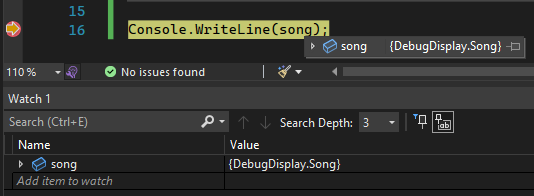
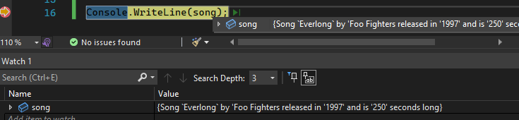
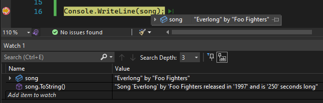
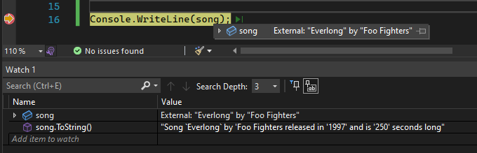

## Daily Knowledge Drop

The `format of how classes are displayed in the debugger can be customized`, using a numer of different methods.

---

## Sample

All the samples below use an instance of the following simple entity class:

``` csharp
// class definition
public class Song
{
    public int Id { get; set; } 

    public string Name { get; set; }

    public string Artist { get; set; }

    public int YearReleased { get; set; }

    public int LengthInSeconds { get; set; }
}

// instance of the class
var song = new Song
{
    Id = 1,
    Name = "Everlong",
    Artist = "Foo Fighters",
    LengthInSeconds = 250,
    YearReleased = 1997
};
```

## Default Display

By default, the output of a class in the debugger uses the _ToString_ method on a class. The default for this method on a class is the _class namespace and  name_.

The output in the _Watch Window_ as well as when hovering the cursor over the instance:

 

## ToString override

The first approach in customizing the output is to `override the ToString` method on the class:

``` csharp
public class Song
{
    //... existing class properties omitted

    // ToString method overridden and customized
    public override string ToString()
    {
        return $"Song `{Name}` by '{Artist} released " +
            $"in '{YearReleased}' and is '{LengthInSeconds}' seconds long";
    }
}
```

This overridden _ToString_ method is now used:

 

---

## DebuggerDisplay attribute

In some use-cases, it might not be possible to use the _ToString_ method, as it might be used in the functionality of the application in a specific format, and a different format is required for the debugger.

The next approach uses the `DebuggerDisplay` attribute - this is used to decorate the class with the format of the debugger display.

``` csharp
[DebuggerDisplay("{Name} by {Artist}")]
public class Song
{
    //... existing class properties omitted

    public override string ToString()
    {
        return $"Song `{Name}` by '{Artist} released " +
            $"in '{YearReleased}' and is '{LengthInSeconds}' seconds long";
    }
}
```

The display in the debugger now uses the _DebuggerDisplay_ format, while explicitly using the _ToString_ method will return the _ToString_ method format.

 

---

## External classes

A 3rd party external class can also be targeted by the attribute.

Assume _Song_ is now a external 3rd party class (which cannot be modified), and has no `DebuggerDisplay` attribute:

``` csharp
public class Song
{
    //... existing class properties omitted

    public override string ToString()
    {
        return $"Song `{Name}` by '{Artist} released " +
            $"in '{YearReleased}' and is '{LengthInSeconds}' seconds long";
    }
}
```

In the _Program.cs_ startup file, the 'DebuggerDisplay` attribute is added with a specified _Target_:

``` csharp
[assembly: DebuggerDisplay("External: {Name} by {Artist}", Target = typeof(Song))]

var song = new Song
{
    Id = 1,
    Name = "Everlong",
    Artist = "Foo Fighters",
    LengthInSeconds = 250,
    YearReleased = 1997
};

Console.WriteLine(song);
```

The format specified by the `DebuggerDisplay` outside the class, is now used:

 

---

## Notes

We've looked at a few useful ways in which the Visual Studio developer experience can be enhanced to improve the quality of life and productivity while working with a solution.

(The same might be experienced in Visual Studio Code and Rider, but it was not tested as part of this post)

---

## References
[Debug attributes in .NET](https://dunnhq.com/posts/2022/debugger-attributes/)  

<?# DailyDrop ?>26: 08-03-2022<?#/ DailyDrop ?>
