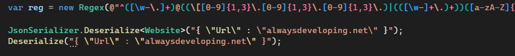
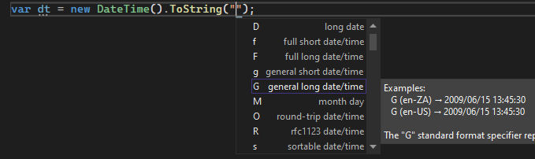
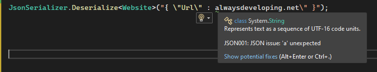
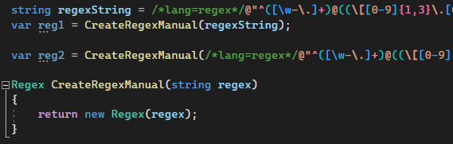
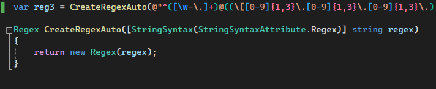
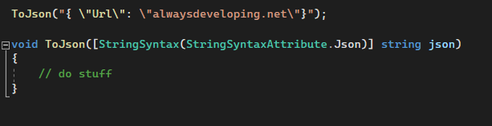

## Daily Knowledge Drop

A new attribute `StringSyntaxAttribute`, being introduced in .NET7, allows for marking a C# string as containing a specific type of value. This results in:
- Syntax highlighting for the specific type
- Basic validation for the specific type.

At the time of this post, this feature is only available in .NET7 preview 1, and when using Visual Studio 2022 17.2.0 Preview 1.0. This may change between now and .NET7 release.

---

## Core libraries

As part of .NET7, the core .NET libraries have been updated, where relevant, to make use of the new attribute.

Currently there are 3 supported types/languages, but the framework is extensible so more languages can be added:
- Regex
- Json
- DateTime

Most, if not all, methods in the core libraries which accept a string parameter of one of these types, now makes use of the attribute.

This allows for full syntax highlighting:

In the above example, you can see how:
- A string being passes to the `Regex` constructor has syntax highlighting
- A bit more subtle, but the string representing a `json` value being passed to JsonSerializer.Deserialize also has syntax highlighting
- A string representing a json value being passed to a normal method does not have any syntax highlighting

In the case of `DateTime`, the attribute provides additional intellisense assistance:

By marking a string with the attribute, basic validation is also applied, based on the language type:

The above string has malformed json (missing quote), but has been marked as containing a json value - Roslyn flags this with a warning to highlight the string has an invalid value according to the specific type.

---

## Non-attribute highlighting

It is also possible to mark a `normal string` with syntax highlighting, outside of using the attribute. This is done by prefixing the string with `/*lang=xxx*/` (where xxx is the language)

Here, a `normal string` declaration has been marked as containing _regex formatting_ and the string has been highlighted accordingly.  

A `string parameter` (not marked with StringSyntaxAttribute) has also had the syntax highlighting applied by using the `/*lang=regex*/` method.

---

## Own libraries

It is also possible to make use of the attribute in our own code, and mark string parameters as being of a certain type. This allows for a better developer experience for users of the libraries/methods:

And an example with json

---

## Notes

This is an amazing and incredibly useful feature, especially for the developers who work with the supported languages/types (Regex, JSON and DateTime at present). With this being extensible, I am excited to see where this goes and the supported languages increase!

---

## References

[.NET Tooling Community Standup - .NET Performance sneak peek!](https://www.youtube.com/watch?v=rwfNDyBBgks)

<?# DailyDrop ?>39: 28-03-2022<?#/ DailyDrop ?>
