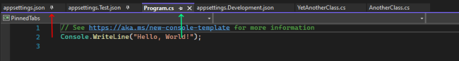
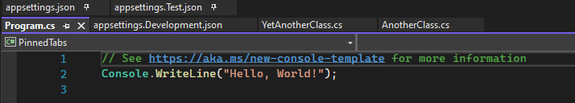

## Daily Knowledge Drop

Visual Studio has the ability to `pin documents` which will ensure, by default, that the documents are always on the left side of the open documents tabs.

However it is also possible to pin the documents so they appear in their `own separate row` - where they are easier to find at a glance.

---

## Default pinning

Below is a screen shot of what the default pinning looks like, with _appsettings.json_ and _appsettings.Test.json_ having been pinned:

The issue with this I find, is that _at a glance its not easy to see which documents are actually pinned_.  

The icon indicating a document is pinned, the vertical pin shown by the `red arrow` and the horizontal pin icon indicating the active, unpinned document, shown by the `green arrow` are very similar at a glace. This similarity is even more prevalent at higher resolutions.

---

## Tabs and Windows options

There is an option in Visual Studio to `Show pinned tabs on separate row`. This can be found by going to _Tools -> Options -> Environment -> Tabs and Windows -> Show pinned tabs in separate row_.

---

## Separate row pinning 

With the _separate row_ option enabled, the pinned documents now (as described), are shown on their own separate row:

At a glace, much easier to see which documents are pinned and which are not.

---

## Notes

A very small tweak to the default Visual Studio settings, but I find this can have a minor positive impact on developer experience when working with pinned documents.

A worthwhile improvement to this feature, would be the ability to drag a document from the unpinned row to the pinned row to automatically pin it, and visa-versa.

---

## References

[Hidden Features Of Visual Studio That Developer Should Know](https://www.c-sharpcorner.com/article/hidden-features-of-visual-studio-that-developer-should-know/)  

<?# DailyDrop ?>61: 27-04-2022<?#/ DailyDrop ?>
