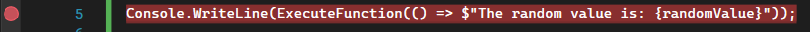
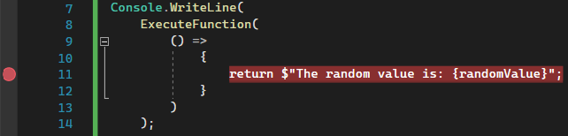
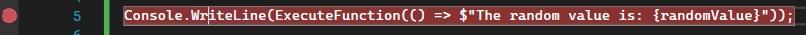
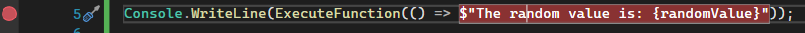

## Daily Knowledge Drop

When a line of code contains multiple statements, the _Toggle Breakpoint_ shortcut `F9`, in combination with the I-beam position, can be used to create a breakpoint on a single statement in the line.

This post refers to Visual Studio functionality - the experience might differ with other IDEs.

---

## The problem

When a single line contains multiple statements, creating a breakpoint by clicking in the row margin creates a breakpoint on the `entire line`.

Consider the code example:

``` csharp
var rando = new Random();
var randomValue = rando.Next(0, 100);

Console.WriteLine(ExecuteFunction(() => $"The random value is: {randomValue}"));

string ExecuteFunction(Func<string> func)
{
    return func.Invoke();
}
```

The intention is to create a breakpoint on the lambda function on **line 4**, to confirm the value of _randomValue_ when the string is generated - however creating a breakpoint using the row margin will result in a breakpoint on the entire line.



This doesn't help in this case, as the breakpoint will be hit when _Console.WriteLine_ is executed, not when the lambda is being executed.

## The resolution

### Code format

One option to be able to set the breakpoint on the single statement, is to re-format the code so each statement is on its own line:

``` csharp
var rando = new Random();
var randomValue = rando.Next(0, 100);

Console.WriteLine(
    ExecuteFunction(
        () => 
            {
                return $"The random value is: {randomValue}";
            }
        )
    );

string ExecuteFunction(Func<string> func)
{
    return func.Invoke();
}
```

A breakpoint can now be set by clicking the margin on **line 8**, and will be hit when the lambda is executed:



### Shortcut

Another easier way is to use the `F9` _Toggle Breakpoint_ shortcut, in combination with the I-beam position to create a breakpoint on a specific statement, not on a specific line.

Clicking on _Console.WriteLine_ (so that the I-beam is blinking anywhere in the words) , and hitting `F9` will result in the _Console.WriteLine_ statement (in this case, the entire line) getting the breakpoint:



However, clicking on the _$"The random value is: {randomValue}"_ string (which is the return statement for the lambda expression) and hitting `F9`, will result in that statement getting the breakpoint:



---

## Notes

The ability to set a breakpoint on a specific statement is an incredibly useful feature, I wish I had known about sooner - but now that I am aware of it, it will be made use of daily.

---

<?# DailyDrop ?>68: 06-05-2022<?#/ DailyDrop ?>
