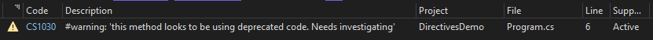

## Daily Knowledge Drop

There are a number of C# directives which can be used to instruct the compiler to generate user-defined errors and warnings as well as control line information:
- #error
- #warning
- #line

---

## #error

The `#error` directive can be used to generate a compiler error with a specific message.

Suppose (for no good reason I can think of), the below code should only be executed when in _Release_ build configuration:

``` csharp
void MethodToOnlyRunInRelease()
{
#if DEBUG
#error Method MethodToOnlyRunInRelease should only be run in release mode
#endif

    // Execute production only logic
}
```

The `#error` directive is used to raise an error with the compiler when the code is built in _DEBUG_ configuration.

In Visual Studio, this will reflect in the **Error List** (as well as in the build output) as follows:


## #warning

The `#warning` directive can be used to generate a compiler warning with a specific message.

Suppose while coding you notice a method is using a deprecated portion of code. A warning note can be left to have it investigated further in future:

``` csharp
void MethodToDoSomething()
{
#warning this method looks to be using deprecated code. Needs investigating

    // Code which does something
}
```

This will raise a warning on the specified line, which will reflect in Visual Studio, in the **Error List** as a warning (as well as in the build output) as follows:



## #line

The `#line` directive can be used to change the line number printed with the compiler message

``` csharp
#line 1201 
void AnotherMethodNeverCalled()
{

}
```

In Visual Studio, this will reflect in the **Error List** as a warning (as well as in the build output) as follows, notice the `line number column` value. 


Instead of the actual file line number, the error will appear on the line relative to the specified line number. In this case, the warning appears on the first line after `#line 1201`, hence it is shown as line 1201.


When using the `#line` directive, the `filename` can also be overwritten:

``` csharp
#line 1 "High performance methods"
void MethodNeverCalled()
{

}
```

In Visual Studio, when a warning or error originates from this area of code, it  will reflect in the **Error List** (as well as in the build output) as follows, notice the `line number column` value and the `File column` value: 


---

<?# DailyDrop ?>69: 09-05-2022<?#/ DailyDrop ?>
