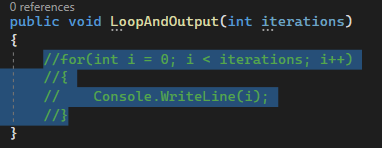
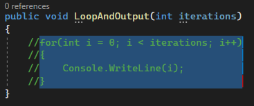
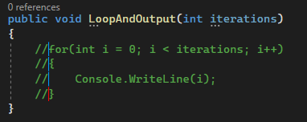
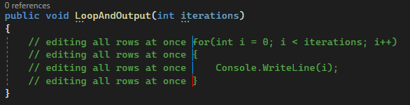

## Daily Knowledge Drop

Holding down the `alt` key while performing a `text selection` with the cursor in Visual Studio will allow for a `rectangular selection`.

---

## Example

The best use case for this feature, is copying commented out code (there are of course many other use cases). For example:

``` csharp
public void LoopAndOutput(int iterations)
{
    //for(int i = 0; i < iterations; i++)
    //{
    //    Console.WriteLine(i);
    //}
}
```

If wanting to copy the commented out text, the usual steps would be to:
1. Copy the code with comments
1. Paste the code into desired location
1. Either manually remove the forward slash characters, or if pasting into an editor which understands code comments, remove them with the relevant button or keyboard shortcut

Highlighting the text for copying would result in something like this:



However, an easier way it to use `alt + cursor selection`. Holding the `alt` keyword while selecting the text with the cursor will result in this:



The highlighted text is now copied and when pasting, will result in the below. No need to manually remove the double forward slash:

``` csharp
for(int i = 0; i < iterations; i++)
{
    Console.WriteLine(i);
}
```


## Bonus tips

### Tip 1

While performing  `alt + cursor selection` one can also drag the cursor vertically to highlight a specific vertical position in the editor, and then edit all highlighted rows at the same time:






### Tip 2

Using the `alt key + the up/down arrows` will result in moving the current line(s) up or down.  

If multiple lines have been selected, `alt + up/down arrow` will result in all highlighted lines moving up or down one row.  
If no lines are highlighted, the line which contains the cursor I-beam will be moved up or down.

---

## Notes

This is one of the small developer quality of life features I wish I had known about sooner, as I'll certainly be using this almost daily.

---


<?# DailyDrop ?>72: 12-05-2022<?#/ DailyDrop ?>
