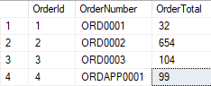
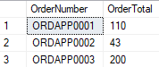
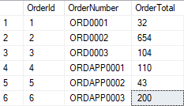

## Daily Knowledge Drop

The `SQL MERGE` statement can be used to perform an INSERT, UPDATE and/or DELETE all in one statement.

This post is just an introduction and does not address any performance issues or other bugs with the statement. See [here](https://www.mssqltips.com/sqlservertip/3074/use-caution-with-sql-servers-merge-statement/) (although out of date) for a list of potential bugs. 

---

## Example

In the below examples, we have a main `Order` table, which stores orders in our e-commerce system. However, orders placed via the mobile app are initially saved into a separate system - but then end up temporarily in the _Order_Incoming_ table, to then be _merged_ into the main `Order` table to give a single view of customer orders.  

The below script will setup the various tables as well as some seed data:

``` sql
IF EXISTS (SELECT 1 FROM SYS.TABLES where name ='Order')
BEGIN 
	DROP TABLE [Order]
END
 
IF EXISTS (SELECT 1 FROM SYS.TABLES where name ='Order_Incoming')
BEGIN 
	DROP TABLE [Order_Incoming]
END
GO
  
CREATE TABLE [dbo].[Order](
  [OrderId] [int] IDENTITY(1,1) NOT NULL,
  [OrderNumber] [varchar](100) NULL,
  [OrderTotal] int
) 
 
CREATE TABLE [dbo].[Order_Incoming](
  [OrderNumber] [varchar](100) NULL,
  [OrderTotal] int
) 

-- create some orders
INSERT INTO [Order]
SELECT 'ORD0001', 32 UNION
SELECT 'ORD0002', 654 UNION
SELECT 'ORD0003', 104
SELECT 'ORDAPP0001', 99

-- incoming orders, 1 existing and 2 new
INSERT INTO [Order_Incoming]
SELECT 'ORDAPP0001', 110 UNION
SELECT 'ORDAPP0002', 43 UNION
SELECT 'ORDAPP0003', 200
```

The tables beforehand:

**Order table:**



**Order_Incoming table:**



---

### Non-MERGE example

First, lets look at an example where we are doing an INSERT and separate UPDATE to ensure that the data in _Order_Incoming_ is inserted or updated into _Order_.

``` sql
-- Insert where the data DOESN'T exist
INSERT INTO [Order]
SELECT OrderNumber, OrderTotal
FROM Order_Incoming oi
WHERE NOT EXISTS(
	SELECT o2.OrderId
    FROM [Order] o2
    WHERE oi.OrderNumber = o2.OrderNumber) 

-- update where the data DOES exist
UPDATE [Order]
SET OrderTotal = oi.OrderTotal
FROM Order_Incoming oi
WHERE [Order].OrderNumber = oi.OrderNumber
```

After these statements, the _Order_ table is updated correct and is as follows:



These two statements clearly work and result in the desired state - but we have two different statements here to ensure the data in _Order_ table is updated and correct.

---

### MERGE 

#### MERGE statement

The format of the MERGE statement as follows:

``` sql
MERGE target_table USING source_table
ON merge_condition
WHEN MATCHED
    THEN update_statement
WHEN NOT MATCHED
    THEN insert_statement
WHEN NOT MATCHED BY SOURCE
    THEN DELETE;
```

A `source` and `target table` is specified, as well as `how to match data` between the two tables, and what action should be performed when:
- there is a `match of data` between the two tables
- there is `no match`, and the data exists in the `target table`
- there is `no match`, and the data exists in the `source table`

---

#### MERGE example

Let's rewrite the non-merge example from above to use the SQL MERGE statement:

``` sql
MERGE [Order] o USING [Order_Incoming] oi
ON o.[OrderNumber] = oi.[OrderNumber]
WHEN MATCHED THEN 
	UPDATE SET o.OrderTotal = oi.OrderTotal
WHEN NOT MATCHED BY TARGET
	THEN 
	INSERT (OrderNumber, OrderTotal)
	VALUES (oi.OrderNumber, oi.OrderTotal);
```

Here we are specifying the _Order_ table as the target, and the _Order_Incoming_ table as the source - with the data matched on the _OrderNumber_ column.
Where there:
- is a `match`: update the _Order_ table with the total from the _Order_Incoming_ table
- is `no match in the target` _Order_ table: insert data from _Order_Incoming_ into _Order_
- is `no match in the source` _Order_Incoming_ table: do nothing


This SQL statement has the same results as the INSERT and UPDATE statements as above - however is simpler to read and understand as well as being more concise.

---

## Notes

Even though I've been working with SQL for approximately 20 years - I've only come across the MERGE statement recently. This would have been incredibly useful earlier in my career when all data access statements were written by hand. More recently though, all (most) data access I've done has been through Entity Framework, which abstracts most of the SQL statements away.  

However knowing MERGE exists and what it can do, can be very useful in situations where you have to write the SQL manually. As with most things, the MERGE statement is not the solution to every problem, and should be benchmarked against other possible solutions (such as a INSERT + UPDATE).


---

## References

[SQL Server MERGE](https://www.sqlservertutorial.net/sql-server-basics/sql-server-merge/)  

<?# DailyDrop ?>81: 25-05-2022<?#/ DailyDrop ?>
