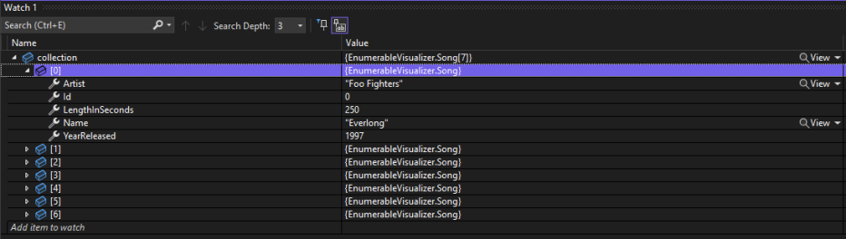
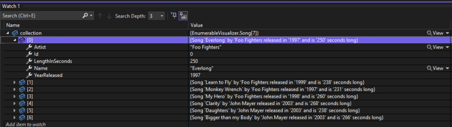
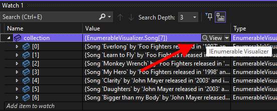
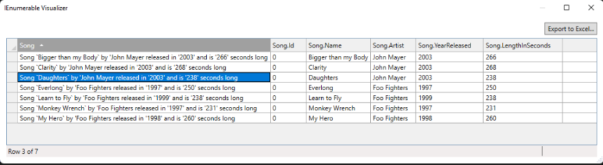

## Daily Knowledge Drop

When coding a system which makes use of collections of data (even reasonably small collections), inspecting, debugging and discovering issues with the dataset can be very difficult and cumbersome. 

The `IEnumerable Visualizer`, available in Visual Studio 17.2, (Visual Studio 2022), aims to make this tedious process easier allowing for easier inspection of collections of data in Visual Studio.

---

## Watch window

When debugging, the starting point for viewing the data being operated on, is the `Watch window`. 



The issue with the Watch window, is when working with collections, its difficult to find a specific record. There is no useful identifying information immediately available without expanding each row one by one to find the relevant record. This is just not sustainable as the collection size grows.

In addition, there is no way to export the collection of information so that it would be inspected in another tool (such as Excel, for example).

---

## Watch and ToString

One method for making it easier to find the relevent record(s), is to overwrite the `ToString` method of the object - in this example, the `Song` object.

``` csharp
public class Song
{
    public int Id { get; set; } 

    public string Name { get; set; }

    public string Artist { get; set; }

    public int YearReleased { get; set; }

    public int LengthInSeconds { get; set; }

    public override string ToString()
    {
        return $"Song `{Name}` by '{Artist} released " +
            $"in '{YearReleased}' and is '{LengthInSeconds}' seconds long";
    }
}
```

The ouput of the `ToString` method, pulls through to the `Watch window`:



At least now one has a visual cue as to the contents of each record without having to expand the row in the window. However, it still requires inspecting each row, which is not sustainable with thousands of rows.
Also, it might not be possible to add a `ToString` method if the entity is owned by a third party.

---

## IEnumerable Visualizer

The `IEnumberable Visualizer` solves many of the issues (but not all) - this window is available by clicking the magnifying glass for the collection, in the Watch window:



This icon will bring up the `IEnumberable Visualizer`:



This windows allows for the data to be:
- Sorted by any column
- Exported to Excel

This will greatly increase the ability to:
- Find the relevent record
- Perform additional operations on the data if required (sums, filtering) via exporting

---

## Notes

Having worked with large collections before, this new visualizer is definitely going ease the pain and difficulty collection inspection brings! There are two future enhancements I feel would add great value to the already useful feature:

- A column in the visualizer which indicates the index of the record in the underlying collection. This will make it easier to find the record in the Watch window to perform updates on the data
- The ability to filter data in the visualizer, making it even easier to find and search for data.

---

## References

[View .NET collections with the new IEnumerable Debugger Visualizer](https://devblogs.microsoft.com/visualstudio/view-net-collections-with-the-new-ienumerable-debugger-visualizer/?WT.mc_id=DOP-MVP-4025064)  
[Debugging collections](https://devblogs.microsoft.com/visualstudio/visual-studio-2022-17-2-is-now-available/#debugging-collections)

<?# DailyDrop ?>91: 08-06-2022<?#/ DailyDrop ?>
