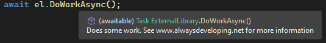
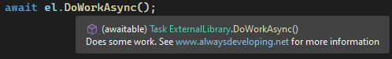
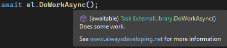
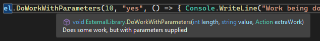
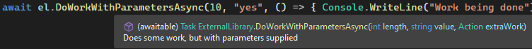
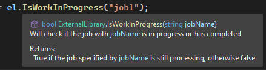
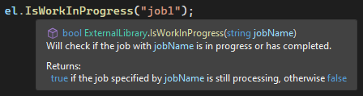

## Daily Knowledge Drop

There are a number of features as part of the C# XML documentation comments (comments prefixed with `///`), which can use used to improved the useability of code. In additional to providing commentary on a class or method etc, there is also the ability to:
 - link to external URLs
 - add general remarks to the comments
 - share comment blocks between methods
 - reference a parameter by name 
 - highlight language keywords


 All of these can be used to enhance the overall quality and usability of the code, especially if the code is part of a library to be referenced and used by external projects.

---

## External Urls

The `seealso` keyword can be used to create a clickable link.

Assume we want to put a URL in a method comment section:

``` csharp
/// <summary>
/// Does some work. See www.alwaysdeveloping.net for more information
/// </summary>
public Task DoWorkAsync()
{
    return Task.CompletedTask;
}
```

With this, the URL is present in the comments, but is not clickable:



Updating the comments to instead used the `seealso` keyword, makes the URL clickable:

``` csharp
/// <summary>
/// Does some work. See <seealso href="www.alwaysdeveloping.net" /> for more information
/// </summary>
public Task DoWorkAsync()
{
    return Task.CompletedTask;
}
```



## General remarks

Instead of adding a general remark to the _summary_ section, it can instead be added to the `remark` section:

``` csharp
/// <summary>
/// Does some work.
/// </summary>
/// <remarks>See <seealso href="www.alwaysdeveloping.net" /> for more information</remarks>
public Task DoWorkAsync()
{
    return Task.CompletedTask;
}
```



## Sharing comments

Comments can be shared, which is especially useful when one has a `method` and an `async version` of the same method. This is done using the `inheritdoc` and `cref` keywords:

``` csharp
/// <summary>
/// Does some work, but with parameters supplied
/// </summary>
/// <param name="length">The length of the work</param>
/// <param name="value">The value of the work</param>
/// <param name="extraWork">An action delegate to specify 
/// any additional work which might need to be done</param>
public void DoWorkWithParameters(int length, string value, Action extraWork) { }

/// <inheritdoc cref="DoWorkWithParameters(int, string, Action)"/>
public Task DoWorkWithParametersAsync(int length, string value, Action extraWork)
{
    return Task.CompletedTask;
}
```

Both methods now show the same comments:





---

## Referencing parameters

Parameters can be referenced in the comments using the `paramref` keyword, making it clearer how the method works and how the parameters are used:

``` csharp
/// <summary>
/// Will check if the job with <paramref name="jobName"/> is in progress or has completed
/// </summary>
/// <param name="jobName">The name of the job to check. 
/// If set to null, a check is performed on any job</param>
/// <returns>True if the job specified by <paramref name="jobName"/>
/// is still processing, otherwise false</returns>
public bool IsWorkInProgress(string jobName)
{
    return false;
}
```

The parameter name is now highlighted whereever it is referenced.



---

## Language keywords

Language keywords can also be highlighted using `langword`. If we take the previous example, and update all the C# keywords (true, false) to indicate they are language keywords:

``` csharp
/// <summary>
/// Will check if the job with <paramref name="jobName"/> is in progress or has completed.
/// </summary>
/// <param name="jobName">The name of the job to check.</param>
/// <returns><see langword="true"/> if the job specified by <paramref name="jobName"/> 
/// is still processing, otherwise <see langword="false"/></returns>
public bool IsWorkInProgress(string jobName)
{
    return false;
}
```

The language keywords are now highlighted:



---

## Libraries

Updating comments with these features improves the usability of the code - however if developing a shared library (a NuGet package for example), there are some additional steps which need to be done to enable the comments being available to users of the library.

The `GenerateDocumentationFile` option needs to be enabled in the csproj:

``` xml
<PropertyGroup>
    <OutputType>Exe</OutputType>
    <TargetFramework>net6.0</TargetFramework>
    <ImplicitUsings>enable</ImplicitUsings>
    <Nullable>enable</Nullable>
    <GenerateDocumentationFile>true</GenerateDocumentationFile>
</PropertyGroup>
```

When the code is compiled, an XML file will now be generated containing all the comments - which should then be included as part of the NuGet package to make the comments available.

---

## Notes

As a library author, for public, but mostly for internal corporate packages - I have found adding comments to be very useful in explaining and conveying to the user how a method and class works, lessening the number of questions and queries received. The additional features mentioned above will take the commentary to another level.


---

## References

[Nick Craver Tweet](https://twitter.com/Nick_Craver/status/1516050534670741505)  

<?# DailyDrop ?>94: 10-06-2022<?#/ DailyDrop ?>
