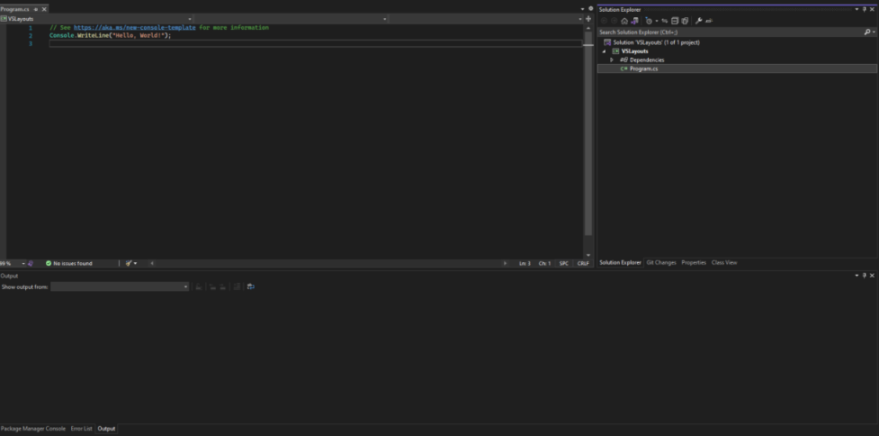
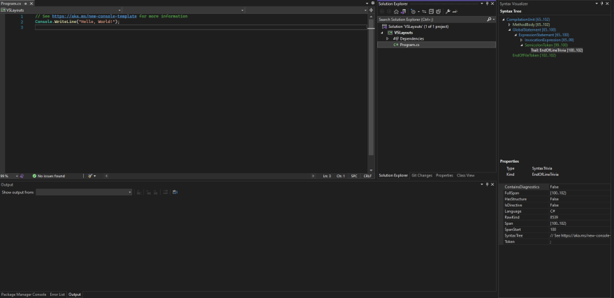
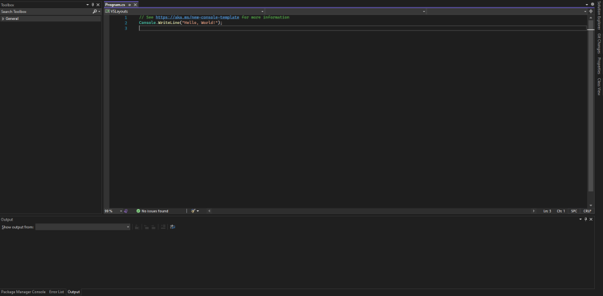

## Daily Knowledge Drop

Visual Studio provides the functionality to configure different `layouts` and switch between, based on the type of project or work being done.

---

## Examples

### Default

Creating and then switching between different layouts is as easy as clicking a button.

For me, the first step is to create a `Default` layout - a general purpose layout, suitable for most type of development work I do.  

This entails configuring the panes and windows in Visual Studio to have the desired layout, then selecting the `Window -> Save Window Layout` menu option. A prompt will appear to give the layout a name - `Default` for me.  

The actual panes and layout is unimportant, but what is important is what you have something which works for you. My default:

Now that there is a default saved, you can easily move things around and at the click of a button go back to the default. By clicking `Window -> Apply Window Layout -> Default` (or Ctrl-Alt-1), the panes and windows are restored to the `Default` layout.

Let's create another layout and switch between them.

---

### Analyzer

When working with [Roslyn Analyzers](../../../../p/analyzer-explained/), the _Syntax Visualizer_ is an critical window, so one would want this to be prominent.

I have update the layout to be as follows below, and saved it as my `RoslynAnalyzer` layout. As you can see, the _Syntax Visualizer_ is now displayed on the right, using a good portion of screen real estate:

The `Window -> Apply Window Layout -> X` menu option (or Ctrl-Alt-1 and Ctrl-Alt-2) can now be used to easily switch between the layouts at the click of a button.

---

### Design

Another example is when doing design work which involves the _Toolbox_, one might want as much space to use the designer:

Here the right panel has been made to "auto hide" to give as much space as possible to the middle pane for design (this could also apply to code as well, if thats what works for you)

---

## Notes

The ability to customize and personalize the layout in Visual Studio can definitely lead to more productivity and a sense of comfort with one's tools. The ability to customize it even more based on the _type of work_ just increases that productivity even more!

Some additional scenarios for when one might want a different, custom layout:
- Projects which use the database related windows vs non-database projects
- Projects which contain unit tests (and the usage of the related windows) vs projects with no unit tests

---

## References

[Create and save custom layouts](https://docs.microsoft.com/en-us/visualstudio/ide/customizing-window-layouts-in-visual-studio?view=vs-2022#create-and-save-custom-layouts)  

<?# DailyDrop ?>102: 23-06-2022<?#/ DailyDrop ?>
