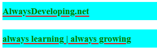
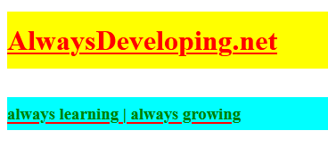
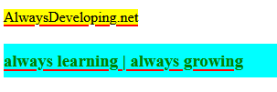
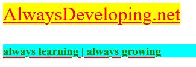
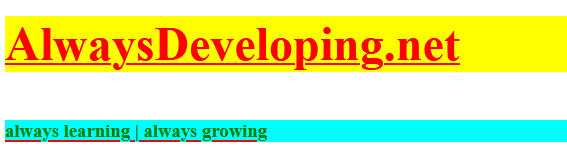

## Daily Knowledge Drop

The CSS `all` property can be used to reset all properties on an element to their initial values.  

Not directly related to .NET/C#, but still relevent to any .NET developer doing any kind of web development.

---

## Valid values

Before we see the `all` property in action, le't have a look at all its possible values:

- **_initial_**: Specifies that all the element's properties should be changed to their initial values.
- **_inherit_**: Specifies that all the element's properties should be changed to their inherited values.
- **_unset_**: Specifies that all the element's properties should be changed to their inherited values if they inherit by default, or to their initial values if not.
- **_revert_**: Resulting values depend on the stylesheet origin where this property is located.
- **_revert-layer_**: Specifies that all the element's properties should roll back the cascade to a previous cascade layer, if one exists.


--- 

## Example

### Base

The below examples will use this HTML and CSS snippet:

``` html
<!DOCTYPE html>
<html>

<head>
    <style>
        article {
            color: red;
            text-decoration: underline;
            font-size: 24pt;
        }

        h1 {
            color: green;
            font-size: 14pt;
            line-height: 2em;
            background-color: aqua;
        }

        .title {}
    </style>
</head>
<article>
    <h1 class="title">AlwaysDeveloping.net</p>
    <h1>always learning | always growing</p>
</article>

</html>
```

The above results in this well designed, elegant HTML page:



---

### The issue

The "issue" with this setup that, as `h1` element with the `title` class automatically inherits all the properties from `h1`, so to generally stop this inheritence, I've been manually overwriting each inherited property.

For example, if we _just_ want the `title` class element to have a yellow background, but none of the other properties inherited from `h1`, then the following is required:

``` html
<style>
    article {
        color: red;
        text-decoration: underline;
        font-size: 24pt;
    }

    h1 {
        color: green;
        font-size: 14pt;
        line-height: 2em;
        background-color: aqua;
    }

    .title {
        color: red;
        font-size: 24pt;
        background-color: yellow;
    }
</style>
```

Each property that is inherited from `h1` needs to be set back to the `article` value.

This results in the HTML looking as we want it, as follows:



However, the `all` property can simplify this for us! Next we'll have a look at how this property effects the HTML output.

---

### initial

First up, the `all` property with a value of `initial` - this sets the properties back to their _initial values_.

``` html
<style>
    article {
        color: red;
        text-decoration: underline;
        font-size: 24pt;
    }

    h1 {
        color: green;
        font-size: 14pt;
        line-height: 2em;
        background-color: aqua;
    }

    .title {
        all: initial;
        background-color: yellow;
    }
</style>
```

Here, we set `all: initial` and then set the background color to yellow. The result is as follows:



The properties of `article` are not (all) respected - the element reverts back to its _initial values_ and then subsequent defined properties (background of yellow) are applied.

---

### inherit

Next up, the `all` property with a value of `inherit` - this sets the properties back to their _inherited values_.

``` html
<style>
    article {
        color: red;
        text-decoration: underline;
        font-size: 24pt;
    }

    h1 {
        color: green;
        font-size: 14pt;
        line-height: 2em;
        background-color: aqua;
    }

    .title {
        all: inherit;
        background-color: yellow;
    }
</style>
```

As with the previous example, here we set `all: inherit` and then set the background color to yellow. The result is as follows:


The properties of `title` revert back to the inherited values from `article` - this is the same outcome as when each property was manually overwritten, just with less manual work!

For completeness we'll have a quick look at the other `all` property values as well.

---

### unset

Next up, the `all` property with a value of `unset` - this sets the properties back to either their respective value, either _initial or inherited_.

``` html
<style>
    article {
        color: red;
        text-decoration: underline;
        font-size: 24pt;
    }

    h1 {
        color: green;
        font-size: 14pt;
        line-height: 2em;
        background-color: aqua;
    }

    .title {
        all: unset;
        background-color: yellow;
    }
</style>
```

At first glance it might seem like the output is the same as `all: inherit`, but the padding and width of the elements have been reset (or unset) in this instance.



---

### revert and revert-layer

Lastly is the `all` property with a value of `revert` or `revert-layer`. These have been grouped together for this example as they produce the exact same result.

``` html
<style>
    article {
        color: red;
        text-decoration: underline;
        font-size: 24pt;
    }

    h1 {
        color: green;
        font-size: 14pt;
        line-height: 2em;
        background-color: aqua;
    }

    .title {
        all: revert;
        background-color: yellow;
    }
</style>
```



---

## Notes

Having recently moved this blog to [Statiq](www.statiq.dev), which included customizing the theme - I wish I had learnt about this property sooner.  

I don't often do website styling, but if (when) I do in future, I'll be sure to keep this property in mind.

---

## References

[all Property](https://www.smashingmagazine.com/2022/05/lesser-known-underused-css-features-2022/#all-property)  

<?# DailyDrop ?>106: 29-06-2022<?#/ DailyDrop ?>
