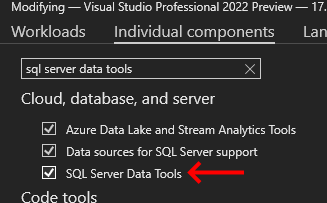
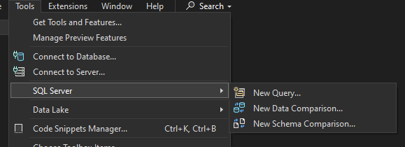
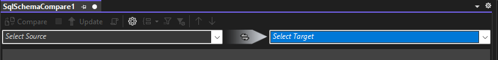
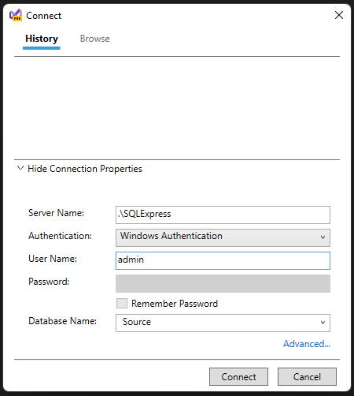
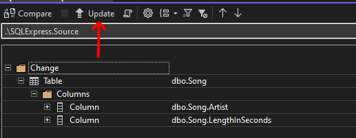
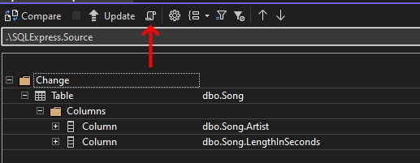

## Daily Knowledge Drop

Visual Studio has a built in feature called `Schema Compare` which easily allows for the comparing of two SQL database schemas and the generation of a script to bring them in sync.

In the past I've had to perform database schema comparisons numerous times (admittedly the majority of these times have been in the fairly distant past when proper CI/CD tools and DevOps practices were not in place) - and there were limited tools available. `Schema Compare` contains the all the features I've required in the past in an incredibly simple to use package.

---

## Installation

The feature is available through the installation of the `SQL Server Data Tools` Visual Studio component. One can use the _Visual Studio Installer_ to confirm if the component is installed or not:
- Open _Visual Studio Installer_
- Click _Modify_ on the relevent Visual Studio installation
- Select the _Individual components_ tab
- Search for "sql server data tools"



Once installed, the feature will be available under `Tools -> SQL Server -> New Schema Comparison` in Visual Studio:



---

## Usage

The usage of the feature is straightforward - when opened you will be presented with two drop down lists, one to select the _Source_ database and one to select the _Target_ database:



A screen with the traditional database connection settings is presented when adding the _Source_ and _Target_ database:



Once the _Source_ and _Target_ databases have been set, the `Compare` button becomes available - clicking on this will perform the database comparison.

A list of differences between the databases will be presented, drilling down and clicking on the specific item will then show the specific difference.

In the example below, there are differences between the _Song_ tables in the two databases:
- a _Length_ discrepancy on the _Artist_ column
- a _Nullability_ discrepancy on the _LengthInSeconds_ column

Clicking on the _Length_ item, displays the specific difference:


---

## Application

Once the differences have been identified, the next step is bring the _Destination_ database in line with the _Source_ database.

This can be done by `updating the target database directly`:



This may not always be possible or feasible, so another option is to have a `script generated` to align the _Target_ to the _Source_:




The script generated by the tool looks as follows (abbreviated to include only the relevent portion):

``` sql
--
--
-- some preamble removed for brevity
--
--
USE [$(DatabaseName)];


GO
PRINT N'Altering Table [dbo].[Song]...';


GO
ALTER TABLE [dbo].[Song] ALTER COLUMN [Artist] NVARCHAR (500) NOT NULL;

ALTER TABLE [dbo].[Song] ALTER COLUMN [LengthInSeconds] INT NULL;


GO
PRINT N'Update complete.';
```


By default all differences are included in the `Update` or `Generate Script` but it is possible to uncheck specific differences if you wish to exclude them from the update.

---

## Notes

In a perfect world this feature is never required as DevOps practices ensure that a dev, test and production database are always in sync (or can easily be brought in sync). However in the real world, differences sometimes occur - sometimes its easier to sync a database schema from production to dev instead of creating the dev database from scratch, for example.

In these cases, the `Schema Compare` feature will prove to be invaluable in tracking down and remedying any differences.

---


## References

[How to compare two SQL databases from Visual Studio](https://www.sqlshack.com/how-to-compare-two-sql-databases-from-visual-studio/)   

<?# DailyDrop ?>116: 13-07-2022<?#/ DailyDrop ?>
