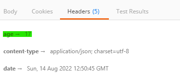

## Daily Knowledge Drop

Built in `output caching` support is being introduced with .NET 7, providing `caching functionality for minimal api responses`. The functionality is highly configurable allowing for fast, yet accurate responses from a minimal api.

---

## Endpoints

### Default endpoint

In these examples, a simple minimal api endpoint will be used as a base, which _returns the current datetime when invoked_:

``` csharp
app.MapGet("/date", () =>
{
    return DateTime.Now;
});
```

---

### Default caching

Let's start by adding default caching to the endpoint. There are basically 3 steps to be performed to configure output caching (these are the same three steps that apply to most  API functionality):

1. Configure the `dependency injection container`:

    ``` csharp
    builder.Services.AddOutputCache();
    ```

1. Configure the api `middleware pipeline`:
    ``` csharp
    app.UseOutputCache();
    ```

1. Define the endpoint, and `apply the output cache functionality to the endpoint`:

    ``` csharp
    app.MapGet("/datedefaultcache", () =>
    {
        return DateTime.Now;
    }).CacheOutput();
    ```

Invoking the `/date` endpoint will always result in a new return value, however invoking `/datedefaultcache` a cached value will be returned (apart from the first time it is invoked). By default, the response is cached for 60 seconds.

Inspecting the response headers (by using a tool like Postman, for example), one can see the age of the cached response (in seconds) is included:



By default, once the cache is 60 seconds old, it expires and the next request to the endpoint will generate a new cache.

---

### Caching policy

It is also possible to define one or more `cache policy` which allows for finer control of the behavior over the caching mechanism. A policy can either be defined as part of the `AddOutputCache` call, and then applied to one or many endpoints (as is shown in the example immediately below), or defined when applying caching to a specific endpoint (as shown in an _VaryBy_ example further down).

1. Define the `caching policy`:

    ``` csharp
    builder.Services.AddOutputCache(options =>
    {
        options.AddPolicy("ignore-cache", p => p
            .With(ctx => !ctx.HttpContext.Request.Headers.ContainsKey("ignore-cache"))
        );
    });
    ```

    This policy looks for the presence of a header called _ignore-cache_ and only applies the cache policy if the header is **not** present (irrespective of the header value)

1. `Apply the policy` to an endpoint:

    ``` csharp
    // option to ignore
    app.MapGet("/dateignorecache", () =>
    {
        return DateTime.Now;
    }).CacheOutput("ignore-cache");
    ```

    Invoking this endpoint will result in default caching behavior, _unless_ a header named `ignore-cache` is included in the request, in which case caching will be ignored.

---

### Caching VaryBy

Another feature which can be leveraged, is the ability to `cache by a specific value`. The built in options available are to cache:
- By query
- By header
- By value

In the below example, the output is `cached by the query string value 'timezone'`:

``` csharp
app.MapGet("/datetimezone", (string? timezone) =>
{
    // insert some logic to get the correct datetime
    // based on the timezone
    return DateTime.Now;

}).CacheOutput(p => p.VaryByQuery("timezone"));
```

When the endpoint is invoked with a specific timezone (_/datetimezone`?timezone=CAT`_ for example), the output will be cached while the same timezone query string is provided. If another timezone is provided (_/datetimezone`?timezone=GMT`_ for example), the same cache used for CAT is **not applied** and a new cache will be generated specific for `GMT`. The cache will `vary by a query string value`. The same logic can be applied to a header value, or any other custom value.

---

### Evicting cache

In some instances it might be required to `manually invalidate a cache` if we know the content is no longer valid. The below example is very simple (for demo purposes), but the same mechanism can be extended for more elaborate use cases:

The first step is to `tag the output cache`:

``` csharp
app.MapGet("/datetimetag", () =>
{
    return DateTime.Now;

}).CacheOutput(t => t.Tag("current"));
```

Here when the `/datetimetag` endpoint is called, the output cache is tagged with the name _"current"_.

The implementation of `IOutputCacheStore` (configured with dependency injection using the _AddOutputCache_ method) can then be injected where and when required to `evict` (invalidate) a cache using the tag.

In this example, another endpoint is defined which will evict the cache for the `/datetimetag` endpoint:

``` csharp
app.MapGet("/datetimeclear", (IOutputCacheStore cache) =>
{
    // evict the cache tagged with "current"
    cache.EvictByTagAsync("current", default);
});
```

---

## Notes

Another very useful and easy to configure feature coming with .NET 7 (along with [rate limiting](../../08/31-rate-limiting/), for example) - making minimal api's even more powerful and bringing it closer to parity with the more traditional MVC (controllers) approach.

---

## References

[Nick Chapsas - The NEW caching you should be using in .NET 7](https://www.youtube.com/watch?v=0WvGwOoK-CI)   

<?# DailyDrop ?>155: 07-09-2022<?#/ DailyDrop ?>
