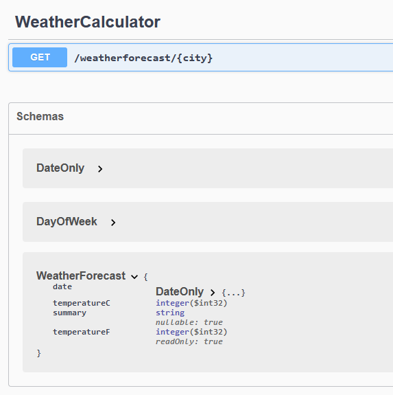
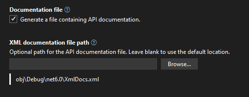
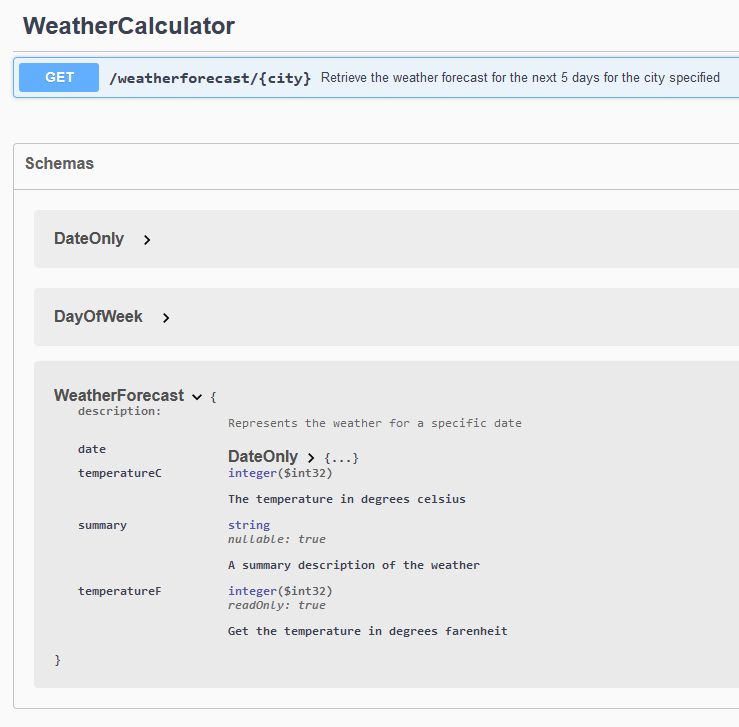

## Daily Knowledge Drop

Code comments can be used to `populate the swagger document` with helpful comments when working with minimal API's.

The `XML Documentation comments` (those comments starting with `///`) are output to an XML documentation file on application build - this file is then be user to populate the swagger document at runtime.

---

## Code

For the below sample, the default _weatherforecast_ endpoint will be used, but modified slightly.

### Endpoint definition

The first step is break out the various components to make them easier to comment.

Move the _WeatherForecast_ response object into its own file, _WeatherForecast.cs_:

``` csharp
public record WeatherForecast(DateOnly Date, int TemperatureC, string? Summary)
{
    public int TemperatureF => 32 + (int)(TemperatureC / 0.5556);
}
```

The lambda delegate which is called when the _GET "weatherforecast"_ endpoint is called, is also moved into its own static method in the _WeatherCalculator_ class:

``` csharp
public class WeatherCalculator
{
    static string[] summaries = new[]
    {
        "Freezing", "Bracing", "Chilly", "Cool", "Mild", 
        "Warm", "Balmy", "Hot", "Sweltering", "Scorching"
    };

    public static WeatherForecast[] GetWeather([FromRoute]string city)
    {
        _ = city;

        var forecast = Enumerable.Range(1, 5).Select(index =>
        new WeatherForecast
        (
            DateOnly.FromDateTime(DateTime.Now.AddDays(index)),
            Random.Shared.Next(-20, 55),
            summaries[Random.Shared.Next(summaries.Length)]
        ))
        .ToArray();

        return forecast;
    }
}
```

A _city_ field was also added to the _GetWeather_ as a parameter - this is not used and is just added to demonstrate how it is reflected on the swagger document.

The endpoint is then updated to invoke the static `GetWeather` method instead of invoking the delegate:

``` csharp
// the swagger and api dependency injection
// and middleware components will automatically
// be added if the correct template settings 
// were chosen
builder.Services.AddEndpointsApiExplorer();
builder.Services.AddSwaggerGen();

var app = builder.Build();

if (app.Environment.IsDevelopment())
{
    app.UseSwagger();
    app.UseSwaggerUI();
}

// change from delegate to call the static method
// created above
app.MapGet("/weatherforecast/{city}", WeatherCalculator.GetWeather);
```

If running the application and browsing to the swagger endpoint, it should work as before (before the code modifications), but still not documentation added:



---

### XML Documentation

The next step is to add XML documentation comments to the code. In Visual Studio, _auto-complete_ will create the XML document structure by `typing /// above a class or method`

Updated _WeatherForecast_ response object:

``` csharp
/// <summary>
/// Represents the weather for a specific date
/// </summary>
/// <param name="Date">The date for the weather forecast</param>
/// <param name="TemperatureC">The temperature in degrees celsius</param>
/// <param name="Summary">A summary description of the weather</param>
public record WeatherForecast(DateOnly Date, int TemperatureC, string? Summary)
{
    public int TemperatureF => 32 + (int)(TemperatureC / 0.5556);
}
```

The updated _WeatherCalculator_ class and static _GetWeather_ method:

``` csharp
/// <summary>
/// Contains logic to get the weather forecast details
/// </summary>
public class WeatherCalculator
{
    static string[] summaries = new[]
    {
        "Freezing", "Bracing", "Chilly", "Cool", "Mild", 
        "Warm", "Balmy", "Hot", "Sweltering", "Scorching"
    };

    /// <summary>
    /// Retrieve the weather forecast for the next 5 days for the city specified
    /// </summary>
    /// <param name="city">The city for the weather forecasts should be retrieved</param>
    /// <returns>The forecast details for the next 5 days</returns>
    public static WeatherForecast[] GetWeather(string city)
    {
        _ = city;

        var forecast = Enumerable.Range(1, 5).Select(index =>
        new WeatherForecast
        (
            DateOnly.FromDateTime(DateTime.Now.AddDays(index)),
            Random.Shared.Next(-20, 55),
            summaries[Random.Shared.Next(summaries.Length)]
        ))
        .ToArray();

        return forecast;
    }
}
```

Doing the above is good practice whether using this technique to populate the swagger document or not, as it provides context and information for future developers of the code. 

At this point this information is not available publicly. Next step we'll make the XML documentation details available outside the code.

---

### File generation

This step is very straight forward - the `Documentation file` option needs to be set on the project. This can be done in one of two ways:

- Add the `GenerateDocumentationFile` node directly to the csproj file:

``` xml
<PropertyGroup>
    <TargetFramework>net6.0</TargetFramework>
    <Nullable>enable</Nullable>
    <ImplicitUsings>enable</ImplicitUsings>
    <GenerateDocumentationFile>true</GenerateDocumentationFile>
</PropertyGroup>
```

- Set the flag in the `project properties`:



Compiling the code will now also _generate a XML document file along with the binary_.

Now that we have XML file, next we can instruct the application to populate the swagger document with the details in the XML document file.

---

### Swagger Setup

During application startup, the `builder.Services.AddSwaggerGen()` line should be _replaced_ with the following:

``` csharp
builder.Services.AddSwaggerGen(c =>
{
    c.SwaggerDoc("v1", new() { Title = "My API", Version = "v1" });
    // build up the file path to the XML document
    var filePath = Path.Combine(AppContext.BaseDirectory, "XmlDocs.xml");
    // instruct the swagger generation process to include details
    // from the file
    c.IncludeXmlComments(filePath);
});
```

Now, when browsing to the swagger endpoint the XML comments are included:



---

## Notes

I personally find this method to be clean and very easy to implement and will definitely be using this on all my own API's going forward. This method ensures the code is well documented (for developers), and is also well documented for consumers with minimal additional effort. 
Keep in mind though that the code comments will be publicly exposed to the consumer, so would need to make sense in that context.

---

## References

[Using XML Documentation With ASP.NET Core Minimal API Apps and OpenAPI](https://khalidabuhakmeh.com/using-xml-documentation-with-aspnetcore-minimal-api-apps-and-openapi)  

<?# DailyDrop ?>189: 26-10-2022<?#/ DailyDrop ?>
