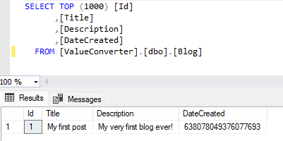

## Daily Knowledge Drop

An EntityFramework `ValueConverter` can be used to convert a property from one value or type to another when reading to and writing from the database.

---

## Example

In the example, the C# class has a `DateTime` property, however when saved in the database, this property will be stored as a `long` (BIGINT in SQL) - a value representing the _DateTime as ticks_.

---

### Scaffolding

The _Blog_ class looks as follows:

``` csharp
[Table("Blog")]
public  class Blog
{
    public int Id { get; set; }

    public string Title { get; set; }

    public string Description { get; set; }

    public DateTime DateCreated { get; set; }
}
```

As one can see, the _DateCreated_ is of type `DateTime`.

The _DBContext_ implementation is configured as per usual:

``` csharp
public class DemoContext : DbContext
{
    public DbSet<Blog> Blogs { get; set; }

    protected override void OnConfiguring(DbContextOptionsBuilder optionsBuilder)
    {
        optionsBuilder.UseSqlServer(
            @"Server=.\SQLEXPRESS;Database=ValueConverter;Integrated Security=True;TrustServerCertificate=True");
    }
}
```

---

### Definition

The first step is to define the `ValueConverter` - this is done by inheriting from `ValueConverter<TModel, TProvider>`.

The converter defined below will:
- Provide functionality to convert from _DateTime_ to _long_ when writing to the database
- Provide functionality to convert from _long_ to _DateTime_ when reading from the database

``` csharp
internal class DateCreatedConverter : ValueConverter<DateTime, long>
{
    // constructor calls into the base constructor
    // with the two methods to do the conversion
    public DateCreatedConverter()
    : base(modelValue => ToTicks(modelValue), 
        provValue => ToDateTime(provValue)) { }

    // convert a long to DateTime - for when reading
    // from the database
    private static DateTime ToDateTime(long ticks)
    {
        return new DateTime(ticks);
    }

    // convert a DateTime to long - for when writing
    // do the database
    private static long ToTicks(DateTime datetime)
    {
        return datetime.Ticks;
    }
}
```

The base `ValueConverter<DateTime, long>` constructor takes two parameters - two _Expressions_ for doing the conversion between the values. Our class defines two methods defining the logic for how the conversion is to the happen, and then passes these methods to the _base constructor_.

The same blueprint can be used to define more complex conversions between property values.

---

### Registration

Now that we have the converter defined, the next step is to register it with the Entity Framework infrastructure. This is done either in an `IEntityTypeConfiguration` implementation for the specific entity, or in this example, in the _OnModelCreating_ method of the DbContext:

``` csharp
public class DemoContext : DbContext
{
    public DbSet<Blog> Blogs { get; set; }

    protected override void OnConfiguring(DbContextOptionsBuilder optionsBuilder)
    {
        optionsBuilder.UseSqlServer(
            @"Server=.\SQLEXPRESS;Database=ValueConverter;Integrated Security=True;TrustServerCertificate=True");
    }

    protected override void OnModelCreating(ModelBuilder modelBuilder)
    {
        // define that the specific property 
        // on the specific entity has the converter
        modelBuilder.Entity<Blog>()
            .Property(b => b.DateCreated)
            .HasConversion<DateCreatedConverter>();

    }
}
```

Here, the specific _property_ on the specific _entity_ is specified to have the converter.

That's all there is to it! Entity Framework will now `automatically apply the conversion when reading to and writing from the database`.

---

### Usage

When interacting with the database using Entity Framework, the `ValueConverter` is automatically used. This includes when creating the table based on the entity schema:

``` csharp
var blog = new Blog
{
    Id = 1,
    Title = "My first post",
    Description = "My very first blog ever!",
    DateCreated = DateTime.Now,
};

var context = new DemoContext();
context.Database.EnsureCreated();
await context.Blogs.AddAsync(blog);
await context.SaveChangesAsync();

```

If we look at the data in the database, the _DateCreated_ property is stored as a BIGINT (the SQL equivalent of a long):



---

## Notes

A very useful feature when needing to convert data/value types between code and the database - some relatively simple configuration, and Entity Framework takes care of the rest.

---


## References

[Value converters in Entity Framework Code (EF Core)](https://shadynagy.com/value-converters-efcore/)  

<?# DailyDrop ?>226: 03-01-2023<?#/ DailyDrop ?>
